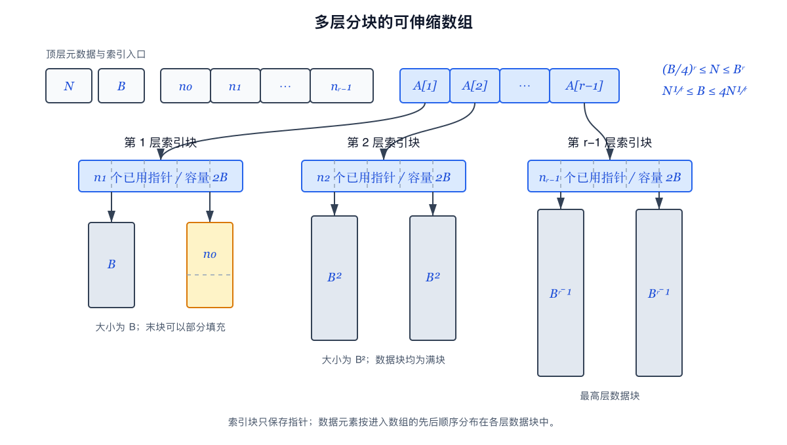
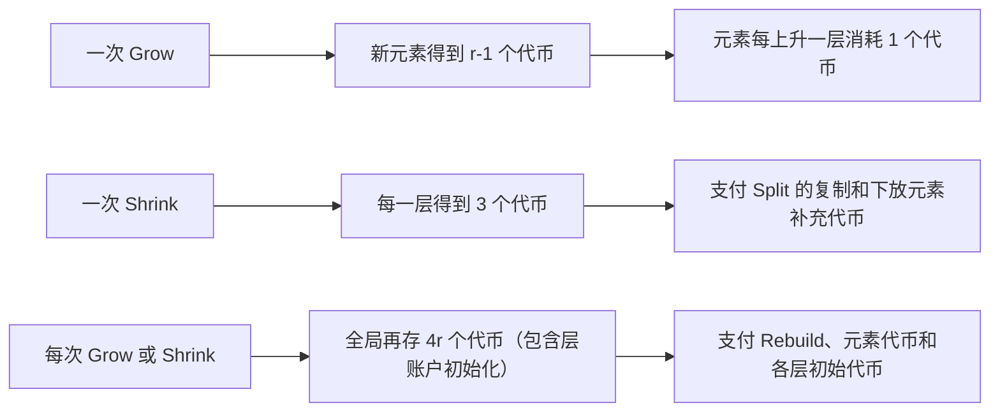

# 《Optimal Resizable Arrays》论文阅读报告

> Robert E. Tarjan、Uri Zwick，*SIAM Journal on Computing*，2024，53(5)：1354–1380。

## 摘要

本报告围绕 Tarjan 和 Zwick 的可变长数组研究展开。原文把操作完成后的稳定冗余 $s(N)$ 与扩缩容期间的临时冗余 $t(N)$ 分开度量，证明二者必须满足 $s(N)t(N)\ge N$；随后从 $r=3$ 的两级分块结构出发，用冗余 $B$ 进制计数器推广到一般 $r$，并通过分块变换在给定参数范围内把稳定冗余降到 $\mathrm{O}(N^{1/r})$。在时间方面，原文用增长博弈证明标准实现的 `Grow` 摊还成本为 $\Theta(r)$，同时保持访问操作的最坏 $\mathrm{O}(1)$ 时间。本报告依次梳理问题模型、旧方法、空间下界、相关工作、数据结构上界、分块变换和时间下界，并说明这些最优性结论的适用范围。

## 1 问题与动机

对于数组而言，其最重要的性质是随机访问：给定下标 $i$，只需根据首地址和元素宽度计算目标地址，便能在 $\mathrm{O}(1)$ 时间内读取或修改元素。然而，传统连续数组的容量在分配时已经固定。若数组之后需要增长，紧随原数组之后的地址可能已被其他对象占用，算法便不能保证原地延长原有内存区间。因此，可变长数组必须借助动态内存管理。

动态内存管理不只意味着申请一个更大的连续数组。其实现至少有两条基本路线：

1. **连续重分配。** 申请一个更大的连续数组，把旧元素复制过去，再释放旧数组；几何扩缩容属于这一路线。
1. **分块表示。** 把一个逻辑数组分散到多个动态申请的固定长度数据块中，再用索引块保存各数据块的指针；HAT、Brodnik 结构以及 Tarjan-Zwick 的新构造都采用这一路线。

无论采用哪条路线，外部看到的仍是同一个按下标排列的逻辑数组。区别只在于元素是否物理连续，以及实现如何在更新时间、索引开销、未使用槽位和重组峰值之间取舍。

本报告研究的抽象数据类型支持 `Get(i)`、`Set(i,x)`、`Grow(x)` 和 `Shrink()`。这里的“末端”或原文所说的“远端”，是指当前最大下标一侧：若数组原来包含 `a0,a1,...,a(N-1)`，`Grow(x)` 产生的新元素是 $aN=x$，`Shrink()` 删除的是 `a(N-1)`。因此，末端更新不会改变任何保留元素的下标。

这一操作边界与任意位置插入、删除的动态序列有本质区别。例如，在

```
[a0, a1, a2, a3]
```

的位置 1 插入 `x` 后，序列变成

```
[a0, x, a1, a2, a3].
```

原来的 `a1,a2,a3` 都获得了新下标，数据结构不仅要容纳一个新元素，还要维护后续元素变化后的秩。本报告讨论的末端 `Grow/Shrink` 不产生这种全局秩变化，所以不能只比较大 O 数值就把两类问题视为相同。原文的单端结果也可以组合成双端可变长数组：分别用两个单端结构保存中心点左右两侧，其中一侧按相反顺序编号。双端更新仍只作用于两个物理末端，也不等于任意位置插删。

最常见的连续重分配方案是几何扩缩容。它保持最坏 $\mathrm{O}(1)$ 的随机访问和摊还 $\mathrm{O}(1)$ 的末端更新，却可能长期保留 $\Theta(N)$ 空槽，并在重建时让新旧两个线性大小的数组短暂共存。HAT 和 Brodnik 等分块方案把冗余降低到 $\mathrm{O}(\sqrt{N})$，但必须额外维护指针和定位规则。

不过，如果仅写“某个方案使用 $\mathrm{O}(N)$ 空间”，则会掩盖两个不同问题：数组在一次操作完成后需要长期保留多少空间，以及一次扩缩容正在执行时会短暂达到多高的空间峰值。Tarjan 和 Zwick 的关键出发点，就是分别度量这两个量。

## 2 模型与双空间指标

### 2.1 内存块模型

根据论文原文所述，其将具体实现视为一组动态申请的固定长度内存块（blocks）。数据块保存元素，索引块保存指针，辅助块保存长度或计数。若当前数组有 $N$ 个机器字大小的元素，则数据本身至少需要 $N$ 个机器字；除一个主索引块外，每个可访问内存块还需要被某个指针指向。这里的“重新分配”和“重建”含义不同：重新分配（`Reallocate`）是内存管理接口对单个连续块进行扩展、搬移或替换；重建（rebuild）是数据结构重新组织多个数据块、索引块和元素的过程。一次重建可能调用多次申请、释放或重新分配。

### 2.2 稳定空间与扩缩容临时空间

对两个非递减函数 $s(N)$ 和 $t(N)$，若一个实现满足：

```
稳定保存大小为 N 的数组：最多 N+s(N) 空间；
执行 Grow 或 Shrink 期间：最多 N+t(N) 空间，
```

则称其为 `(s(N),t(N))`-实现。本报告把 $s(N)$ 统一称为稳定冗余，把 $N+s(N)$ 称为稳定存储空间；把 $t(N)$ 称为扩缩容临时冗余，把 $N+t(N)$ 称为扩缩容临时空间。“稳定”表示一次操作完成后的表示，不表示这些内存永久不释放；“临时”强调 `Grow/Shrink` 的执行过程，而不是另一种独立的数据结构。

双指标的意义在于，应用可能同时保存许多可变长数组，却只在某一时刻调整其中少数数组。此时大多数数组可以保持紧凑表示，共享的工作内存只为正在重组的结构提供短暂空间。不过，这只是理论动机；实际收益仍受缓存、内存分配器、碎片和并发重组影响。

### 2.3 全文术语约定

为避免把不同论文的局部名称误认为不同概念，本报告采用以下主要术语：

| **原文或局部名称** | **本报告主要名称** | **使用规则** |
| --- | --- | --- |
| `Top` | 索引块 | 介绍 Sitarski 原文时写作“Top（索引块）” |
| `Leaf` | 数据块 | 介绍 Sitarski 原文时写作“Leaf（数据块）” |
| `virtual superblock` | 虚拟超级块 | 仅表示 Brodnik 对同尺度数据块的概念分组，不是实际申请的内存块 |
| `Reallocate` | 重新分配 | 指内存接口对一个块的操作 |
| `rebuild` | 重建 | 指数据结构层面的重新组织 |
| `Access` / `Get`、`Modify` / `Set` | 访问、修改 | 本报告统一把两项操作写作 `Get` 与 `Set` |
| `amortized time` | 摊还时间 | 针对任意操作序列的总成本，不写成“平均时间” |
| `standard implementation` | 标准实现 | 仅在原文 §§7–9 的作者定义范围内使用 |
| `growth game` | 增长博弈 | 指时间下界所用的抽象博弈 |

有了操作模型和双空间指标，下面可以把旧方法放到同一坐标系中比较：精确容量方案追求最小稳定冗余却频繁复制，几何扩缩容以线性冗余换取简单和快速，HAT 与 Brodnik 则把任意时刻的冗余降到平方根级。

## 3 三类旧方法

### 3.1 精确容量与几何扩容

若每次 `Grow` 或 `Shrink` 都申请恰好匹配新长度的连续数组，稳定冗余只有 $\mathrm{O}(1)$，但每次更新都要复制 $\Theta(N)$ 个元素，重建时总空间接近 $2N$。它展示了极小稳定空间的一端。

几何扩容位于另一端。设固定扩容因子为

$$
  g = 1+\alpha,  \alpha>0.
$$

当容量为 $N$ 的连续数组刚好装满时，结构申请一个容量约为

$$
  (1+\alpha)N
$$

的新数组，复制原来的 $N$ 个元素，然后释放旧数组。忽略取整和触发扩容的单个新元素，重建刚结束时大约新增 `alpha N` 个空槽，下一次装满前也会发生大约 `alpha N` 次 `Grow`。一次重建复制 $N$ 个元素，因此分摊到这些更新上的复制成本为

$$
  N/(\alpha N) = 1/\alpha
$$

也就是 $\Theta(1/\alpha)$。若把每次 `Grow` 自身写入新元素的常数成本也计入，论文给出的表达式与 $(1+\alpha)/\alpha$ 同阶。因而 $\alpha$ 变小会产生一组方向相反的影响：

```
alpha 变小
-> 每次扩容预留的空槽减少
-> 两次扩容之间可容纳的 Grow 数量减少
-> 扩容更频繁
-> 每次 Grow 的摊还复制成本增大
```

两个数字例子可以显示这一差别：

| **增长因子 $g$** | **$\alpha$** | **刚扩容后的新增空槽** | **约需多少次 `Grow` 再次装满** | **分摊复制量级** |
| --- | --- | --- | --- | --- |
| 2 | 1 | $N$ | $N$ | 约 1 次复制/操作 |
| 1.25 | 0.25 | $0.25N$ | $0.25N$ | 约 4 次复制/操作 |

这里“约 1 次”或“约 4 次”指元素复制次数的摊还量级，不表示一次操作的实际墙钟时间，也忽略了取整、分配器和元素构造成本。增长因子为 2 时，空闲槽数最多可接近当前元素数，也就是已分配容量可能接近一半未使用；增长因子为 1.25 时，刚扩容后的空闲槽约占新容量的 $0.25/1.25=20\%$，但重建明显更频繁。

缩容不能简单地在使用率刚低于 $1/g$ 时立即进行。否则数组在边界附近执行一次 `Shrink` 后缩容，紧接着一次 `Grow` 又可能重新扩容，两个昂贵重建无法由足够多的普通操作分摊。标准做法是使用滞后阈值：若当前容量为 $C$，可以等到元素数降至约

$$
  C/g^2
$$

时，才把容量缩小到约 $C/g$。缩容后装载率约为 $1/g$，离再次扩容或缩容都保留了一段缓冲区间。这个滞后区间保证相邻重建之间发生线性数量的更新，从而维持 $\mathrm{O}(1)$ 摊还成本。

对任意固定 `alpha>0`，几何方案在稳定状态中保留的空槽最多为 $\Theta(\alpha N)=\Theta(N)$，而重建时旧数组和容量约为 $(1+\alpha)N$ 的新数组同时存在，临时冗余也是 $\Theta(N)$。采用后台复制可以把一次大规模重建分散到后续操作，从而获得最坏情况常数更新时间，但这不会自动消除新旧表示共存所需的线性空间。由此得到几何扩缩容的完整取舍：它用线性冗余换取简单地址计算和常数更新界，而减小增长因子只能改善常数比例，不能把冗余降为 `o(N)`。

线性冗余并不是常数更新时间的必要代价。Sitarski 的 HAT 改用等长数据块，只在较少的尺度变化时重建，从而把下面要讨论的冗余降到平方根级。

### 3.2 Sitarski 的 HAT

即便名字中包含"哈希"二字，Sitarski 的哈希数组树（hashed array tree，HAT）并不使用哈希，结构也不是一棵通常意义上的树，而是一个索引块指向若干等长数据块的两级表示。对当前长度 $N$，结构维护一个通常取为 2 的幂的参数 $B$，并保持

$$
  \sqrt{N} \leq B < 4\sqrt{N}.
$$

HAT 的结构不变量如下：

- 一个长度为 $B$ 的索引块 `I`，其中每个已使用位置保存一个数据块指针；
- $\lceil N/B\rceil$ 或 $\lceil N/B\rceil+1$ 个长度均为 $B$ 的数据块；
- 前面的数据块全部填满，只有最后一个非空数据块可以部分填充；
- 结构至多保留一个完全空的数据块，以避免一次 `Shrink` 刚释放末块、下一次 `Grow` 又立即重新申请；
- 所有逻辑元素仍按下标顺序依次排列在这些数据块中。

因此，对从 0 开始的下标 $i$，元素位置可直接计算为

$$
\begin{aligned}
  \operatorname{block}(i)=\left\lfloor\frac{i}{B}\right\rfloor \\
  \operatorname{offset}(i)=i\bmod B.
\end{aligned}
$$

访问过程先读取 `I[block(i)]` 得到数据块指针，再读取该块的 `offset(i)` 位置，只进行常数次内存访问和整数运算。若 $B$ 是 2 的幂，除法和取模还可分别由右移和位掩码实现，所以 `Get` 与 `Set` 都是最坏 $\mathrm{O}(1)$。

`Grow` 在当前尺度尚有容量时分为三种情况：

1. 最后一个数据块未满，直接把新元素写入其下一个空位；
1. 最后一个数据块已满，但结构已经保留一个空数据块，把新元素写入该空块首位；
1. 最后一个数据块已满且没有预留空块，申请一个新的长度 $B$ 数据块，在索引块中登记其指针，再写入新元素。

当 $N=B^2$，长度为 $B$ 的索引块已经指向 $B$ 个满数据块，当前尺度达到容量上限。结构把参数加倍为 $2B$ 并重建。`Shrink` 的普通情况与 `Grow` 对称：删除最后一个元素；末端块变空后可以暂不释放，只有在末端出现两个空块时才释放其中一个。当数组缩小到 $N=B^2/16$，等价于当前 $B=4sqrt(N)$，结构把 $B$ 减半并重建。扩张和收缩使用不同阈值，避免操作序列在一个边界附近来回触发重建。

稳定状态的冗余可以逐项计算：

```
索引块                         B
最后一个部分填充数据块的空位   < B
至多一个预留空数据块            B
长度、计数等辅助信息            O(1)
```

因此总空间至多为 $N+3B+\mathrm{O}(1)=N+\mathrm{O}(\sqrt{N})$。改变 $B$ 时不必同时申请另一套包含 $N$ 个槽的完整结构；新数据块可以逐个申请、填充，旧数据块也可逐个释放，所以重建只需 $\mathrm{O}(\sqrt{N})$ 级临时冗余。另一方面，加倍或减半 $B$ 会使可表示容量改变常数倍，两次同方向重建之间至少发生 $\Omega(N)$ 次 `Grow` 或 `Shrink`，故一次 $\mathrm{O}(N)$ 重建可摊到这些操作上，每次更新的摊还代价仍为 $\mathrm{O}(1)$。

下面是一个自行绘制的小例子。令 $B=4,N=13$，索引块有 4 个位置，前三个数据块填满，第四个数据块只含元素 `a12`：

```
index block I (length 4)
+------+------+------+------+
|  D0  |  D1  |  D2  |  D3  |
+--|---+--|---+--|---+--|---+
   |      |      |      |
   v      v      v      v
 D0       D1       D2       D3
+---+---+---+---+  +---+---+---+---+  +---+---+---+---+  +---+---+---+---+
|a0 |a1 |a2 |a3 |  |a4 |a5 |a6 |a7 |  |a8 |a9 |a10|a11|  |a12|   |   |   |
+---+---+---+---+  +---+---+---+---+  +---+---+---+---+  +---+---+---+---+
```

例如 $i=10$ 时，$\lfloor 10/4\rfloor=2$ 且 $10\bmod 4=2$，所以 `a10` 位于 `D2` 的偏移 2。这个例子也直接显示：末块浪费 3 个槽，但浪费始终小于 $B$。

HAT 说明可变长数组并不必须浪费常数比例空间：分块和一级索引能够把冗余降到 $\mathrm{O}(\sqrt{N})$，同时保留常数访问和常数摊还更新。它仍会在参数 $B$ 改变时重建数据布局；Brodnik 等人的结构进一步改变块尺度组织，使数据元素不必周期性整体搬移。

### 3.3 Brodnik 等人的结构

在Sitarski 的哈希数组树之外，Brodnik、Carlsson、Demaine、Munro 与 Sedgewick 提出了另一种 $N+\mathrm{O}(\sqrt{N})$ 的可变长数组。论文给出两个数据布局变体：第一种使用严格递增的数据块；第二种把数据块大小限制为 2 的幂，以便避免访问定位中的平方根计算。

第一种变体把元素按顺序放入容量为

```
1, 2, 3, ..., k
```

的数据块。前 $k$ 个块的总容量为三角数

$$
  1+2+\ldots+k = k(k+1)/2.
$$

因此，足以保存 $N$ 个元素的最小块数为

$$
  k=\left\lceil\frac{\sqrt{8N+1}-1}{2}\right\rceil=\Theta(\sqrt{N}).
$$

除最后一个块外，其余块都填满；最后一个块可以部分填充。结构还可以保留一个曾经含有元素、后来因 `Shrink` 变空的下一数据块。一个大小为 $\Theta(\sqrt{N})$ 的索引块保存这些数据块的指针，而索引块自身使用最朴素的动态数组方法扩展。数据块、尾块空位、数据块指针以及索引块的未用位置都只有 $\mathrm{O}(\sqrt{N})$ 量级，所以稳定总空间为 $N+\mathrm{O}(\sqrt{N})$。

该布局的 `Grow` 流程是：

1. 若最后一个非空数据块尚未填满，直接写入其下一个位置；
1. 若该块已满但已经存在一个预留空块，把新元素写入空块首位；
1. 否则申请容量为下一整数的新数据块，并把指针加入索引块；
1. 若索引块已满，则申请更大的索引块并复制全部数据块指针；若要求最坏 $\mathrm{O}(1)$ 更新时间，这次指针复制需在后续操作中后台完成。

`Shrink` 删除最后一个元素。若末端数据块变空，可先把它作为预留空块保存；当继续收缩而不再需要它时再释放，并从索引块删除相应指针。这里移动的主要是索引指针，已经装入数据块的元素不会因为全局尺度变化而被周期性整体搬迁。这是它与 HAT 的重要区别。

第一种变体的访问定位来自反解三角数。为避免 0/1 下标混淆，令 $p=i+1$ 表示元素的 1-based 位置，令 $j$ 表示 1-based 数据块编号，则 $j$ 是满足 $j(j+1)/2\geq p$ 的最小整数，即

$$
  j=\left\lceil\frac{\sqrt{8p+1}-1}{2}\right\rceil.
$$

该元素在第 $j$ 个数据块中的 0-based 偏移为

$$
  offset = p - j(j-1)/2 - 1.
$$

例如 $N=8$ 时，块容量依次为 `1,2,3,4`，第四块只使用前两个位置。访问 $i=6$，即 $p=7$，可得 $j=4$、$offset=0$，所以该元素位于第四块首位。

```
index block
+------+------+------+------+
|  D1  |  D2  |  D3  |  D4  |
+--|---+--|---+--|---+--|---+
   v      v      v      v
+----+  +----+----+  +----+----+----+  +----+----+----+----+
| a0 |  | a1 | a2 |  | a3 | a4 | a5 |  | a6 | a7 |    |    |
+----+  +----+----+  +----+----+----+  +----+----+----+----+
 size 1    size 2         size 3              size 4
```

直接计算上式需要整数平方根。为避免依赖该操作，第二种变体只使用大小为 2 的幂的数据块，并把它们组织成虚拟超级块（virtual superblocks）：第 $q$ 个虚拟超级块由 $2^{\lfloor q/2\rfloor}$ 个、每个容量为 $2^{\lceil q/2\rceil}$ 的数据块组成。虚拟超级块只是对相同尺度数据块的逻辑分组，并没有对应的整块内存申请。由元素下标的最高有效位和若干移位即可确定虚拟超级块、其中的数据块以及块内偏移。正文不需要复现其全部位级公式，但必须保留这一逻辑：第一种变体通过反三角数定位，第二种变体通过幂次分组把定位转化为 word-RAM 字操作；在相应机器运算假设下，两者都支持最坏 $\mathrm{O}(1)$ 访问。

HAT 与 Brodnik 结构的差异可以概括如下：

| **方面** | **HAT** | **Brodnik 等人的结构** |
| --- | --- | --- |
| 数据块大小 | 全部为当前参数 $B$ | 递增大小，或按 2 的幂组织 |
| 下标定位 | 商和余数 | 反三角数，或最高有效位与移位 |
| 数据元素重建 | $B$ 改变时需要重建数据布局 | 不需要周期性整体搬移数据元素 |
| 索引处理 | 改变 $B$ 时一并重建 | 索引块可独立扩展并后台复制 |
| 空间 | $N+\mathrm{O}(\sqrt{N})$ | $N+\mathrm{O}(\sqrt{N})$ |
| 更新界 | $\mathrm{O}(1)$ 摊还；可进一步去摊还化 | 在分配假设和后台索引复制下最坏 $\mathrm{O}(1)$ |

两种方案从不同结构出发，却共同达到 $N+\mathrm{O}(\sqrt{N})$。这使问题自然转向下界：平方根是否只是两个设计恰好得到的结果，还是单一峰值空间指标下不可突破的屏障？Brodnik 等人的论证回答了后一个问题。

## 4 为什么旧下界仍允许新结果

第 3 节介绍的 HAT 和 Brodnik 结构虽然采用不同的数据块布局，却都把额外空间控制在平方根量级。这自然提出一个问题：$\sqrt N$ 是这两个具体设计恰好得到的结果，还是旧空间度量下任何可变长数组都无法突破的屏障？要回答这个问题，首先必须区分数据结构给出的空间上界与针对所有数据结构成立的空间下界。

HAT 和 Brodnik 结构给出的是**构造性上界**。在它们各自的内存模型与实现规则下，当逻辑数组包含 $N$ 个元素时，无论结构正处于一次操作完成后的稳定状态，还是正在执行申请新块、复制指针、重建索引等扩缩容步骤，其总空间都可以控制在

$$
N+\mathrm{O}(\sqrt N)
$$

以内。这里的“任意时刻”属于上界保证：研究者已经给出了具体结构，并证明该结构执行过程中不会超过这个空间级别。换言之，上界回答的是“存在一个实现，能够在所有时刻不超过多少空间”。

Brodnik 等人的旧下界使用的量词方向不同。它说明：对任意可变长数组实现，都可以找到一段操作序列以及该序列中的某个时刻，使结构在那个时刻至少使用

$$
N+\Omega(\sqrt N)
$$

空间，其中 $N$ 是发生该峰值时数组的长度。形式化地看，上界近似于“存在一个实现，使其对所有时刻都满足空间上界”；下界则近似于“对每一个实现，都存在某个时刻达到空间下界”。因此，下界只要求平方根级冗余在历史中的某个时刻出现，并没有声称结构在每个时刻、特别是每个操作结束后的稳定状态，都必须保留 $\Omega(\sqrt N)$ 冗余。

把上述上、下界放在传统的单一空间指标下，二者在渐近意义上是匹配的：HAT 和 Brodnik 证明 $N+\mathrm{O}(\sqrt N)$ 足够，而旧下界证明某个时刻的 $N+\Omega(\sqrt N)$ 不可避免。所以，如果评价标准只记录整个执行过程中出现过的最大空间，那么平方根级冗余已经达到最优。但这个结论只确定了“峰值必须出现”，并没有确定峰值必须出现在哪一类状态，也没有说明操作结束后的长期表示必须同样大。

Tarjan 和 Zwick 的关键观察正来自这个量词留下的空间。旧下界所保证的那个峰值时刻，完全可能发生在一次 `Grow` 或 `Shrink` 的内部。例如，数据结构为了重组布局而申请一个新块时，新块已经计入已分配空间，但旧元素尚未全部复制完成，旧块也还不能释放；此时新旧表示短暂共存，从而产生下界要求的空间峰值。复制和释放完成以后，结构却可能回到一个明显更紧凑的稳定表示。因此，“某个时刻必须达到平方根级冗余”并不推出“每次操作完成后都必须保留平方根级冗余”。

基于这一观察，论文不再用一个峰值指标同时描述所有状态，而是分别度量稳定冗余 $s(N)$ 与扩缩容临时冗余 $t(N)$。新的问题不再是笼统地问能否突破 $\sqrt N$，而是问：如果允许 `Grow/Shrink` 过程中短暂使用较大的工作空间，操作完成后的稳定冗余可以压缩到什么程度？反过来，稳定表示越紧凑，扩缩容时至少必须付出多大的临时空间？第 5 节将先重述旧的 $\sqrt N$ 存在性下界，再把上述关系推广为

$$
s(N)t(N)\geq N,
$$

从而精确刻画这两个空间指标之间不能同时减小的约束。

## 5 空间下界

为便于理解，下面两个证明使用同一组内存模型假设。数组元素是任意 word-size 值，因而不能默认进一步压缩；每个数据块都必须由一个指针标识，一个指针占 $\Theta(1)$ words。索引块与长度、计数等辅助信息也计入空间，而且只会消耗更多冗余，不会使可用数据块数量增加。最后，新块刚申请时为空；在元素复制完成以前，旧元素仍必须存在于原数据块中。原文定理 4.2 还使用原文定义 2.1 的约定：$s(N)$ 和 $t(N)$ 都是非递减函数。

### 5.1 原文定理 4.1：$\sqrt{N}$ 下界

**定理。** 即使操作序列只包含 `Grow` 和访问，任何可变长数组实现也必定在某些时刻使用 $N+\Omega(\sqrt{N})$ 空间，其中这里的 $N$ 指该时刻数组的长度。

**证明。** 从空数组开始执行一段共 $N$ 次的 `Grow` 操作。执行完毕时，$N$ 个元素分布在 $k$ 个连续数据块中。根据 $k$ 的大小分两种情况。

若 $k\geq \sqrt{N}$，保存数据本身至少需要 $N$ words，而标识这 $k$ 个数据块至少需要 $k$ 个指针。因此最终时刻的空间至少为

$$
  N+k \geq  N+\sqrt{N}.
$$

若 $k<\sqrt{N}$，由平均值原理，至少存在一个容量为 $\ell$ 的数据块满足

$$
  \ell \geq  N/k > \sqrt{N}.
$$

设这个大块在历史上数组长度为 $N'\leq N$ 时被申请。新块刚申请时还没有替代旧表示，因此当时已有的 $N'$ 个元素仍在其他数据块中，新块的 $\ell$ 个槽必须与它们短暂共存。又因为 $N'\leq N$，所以

$$
  \ell > \sqrt{N} \geq  \sqrt{N'}.
$$

故该历史时刻的总空间至少为

$$
  N'+\ell > N'+\sqrt{N'}.
$$

在定理陈述中把这个发生峰值时的数组长度 $N'$ 重新记为 $N$，便得到“某些时刻使用 $N+\Omega(\sqrt{N})$ 空间”的结论。证毕。

证明中的两个 case 可以概括为：块多会增加指针开销；块少则迫使某个块很大，而这个大块被申请时必须与旧元素共存。需要注意，定理没有声称每个稳定状态都有 $\sqrt{N}$ 冗余；第二种情况的峰值可能发生在早于最终第 $N$ 次 `Grow` 的历史时刻。该下界也不依赖 `Grow` 究竟花费多少时间。

### 5.2 原文定理 4.2：乘积下界

**定理。** 任何 `(s(N),t(N))`-implementation 都必须满足

$$
  s(N)t(N) \geq  N
$$

即使只支持 `Grow` 和访问。

**证明。** 在第 $N$ 次 `Grow` 完成后的稳定状态，额外空间至多为 $s(N)$。由于每个数据块至少需要一个指针，并且每个指针占一个常数数量的 words，数据块数至多为 $s(N)$（若精确考虑指针表示常数，则结论只相差常数因子）。索引块的空槽和其他辅助信息同样占用 $s(N)$，只会让实际可保存的指针数更少，不会破坏这一上界。

$N$ 个元素分布在至多 $s(N)$ 个数据块中。由平均值原理，至少有一个数据块 $B$ 的容量满足

```
|B| >= N/s(N).
```

设 $B$ 在历史上数组长度为 $N'\leq N$ 时被申请。刚申请时 $B$ 为空，复制完成前原有元素仍在其他数据块中，所以这一时刻的临时额外空间至少为 `|B|`，即

```
t(N') >= |B| >= N/s(N).
```

现在才使用 `t` 的非递减性。由于 $N'\leq N$，

$$
  t(N) \geq  t(N') \geq  N/s(N)
$$

两边乘以 $s(N)$，得到

$$
  s(N)t(N) \geq  N.
$$

证毕。

这个证明中，块数上界来自指针空间，最大块下界来自平均值原理，而单调性只用于把历史时刻的 `t(N')` 转换成最终参数 $t(N)$。它证明的是稳定冗余与扩缩容临时冗余之间的空间权衡，并没有推出任何 $\Omega(r)$ 更新时间下界。

**原文推论 4.3。** 若

$$
  s(N)=\mathrm{O}(N^{1/r})
$$

则原文定理 4.2 给出

$$
\begin{aligned}
  t(N) = \Omega(N/s(N)) \\
  = \Omega(N^{1-1/r}).
\end{aligned}
$$

两个最重要的具体代入为：

| **$r$** | **稳定冗余 $s(N)$** | **必需的临时冗余下界 $t(N)$** |
| --- | --- | --- |
| 2 | $\mathrm{O}(N^{1/2})$ | $\Omega(N^{1/2})$ |
| 3 | $\mathrm{O}(N^{1/3})$ | $\Omega(N^{2/3})$ |

$r=2$ 对应 HAT 和 Brodnik 等旧结构所处的平衡点；$r=3$ 则预告原文 §5 的新构造。如果希望稳定状态只有立方根级冗余，某些 `Grow` 中就不可避免地出现三分之二次幂级临时冗余。

## 6 上界构造与时间下界的衔接

原文 §5 的 $r=3$ 结构正好达到 $N+\mathrm{O}(N^{1/3})$ 稳定存储空间和 $N+\mathrm{O}(N^{2/3})$ 扩缩容临时空间；原文 §6 先得到 $N+\mathrm{O}(rN^{1/r})$ 稳定存储空间，原文 §7 再对 $r(N) \leq (1/2)\log N/\log\log N$ 给出 $N+\mathrm{O}(N^{1/r})$ 稳定存储空间。因此，原文定理 4.2 不只是一个独立的限制，它预先给出了后续构造应该追求的指数。对固定整数 $r$，上述增长条件自然成立。

然而，空间下界并不说明 `Grow/Shrink` 的摊还时间必须为 $\Omega(r)$。该时间下界需要原文 §§8–9 的增长博弈，并且严格适用于作者定义的标准实现。因此，空间最优性与时间最优性需要分别证明，再在结论中合并；不能只引用原文定理 4.2，就声称所有维度均已达到最优。

在进入具体的上界构造之前，本报告先把上述空间权衡放回相关工作和发表后发展的脉络中。第 7 节完成这一背景说明后，本报告第 8 节将从原文 §5 的 $r=3$ 具体结构开始，介绍匹配空间下界的上界构造。

## 7 相关工作与发表后发展

在转入上界构造前，本节先从直接前驱、简洁动态数据结构背景、一般动态序列和发表后实现几个方面定位 Tarjan-Zwick 的贡献。前文为了验证复杂度，已经技术性地介绍了几何扩缩容、HAT 和 Brodnik 结构，本节不再重复其完整操作流程。

### 7.1 可变长数组的直接前驱

标准意义下的几何扩缩容确立了最常见的基线：连续存储带来最简单的常数访问；固定增长因子带来常数摊还更新；代价是稳定状态与重建过程都可能出现 $\Theta(N)$ 冗余。减小增长因子只能改变常数比例，不能得到 $N+o(N)$ 空间[3, §17.4]。

Sitarski 1996 年提出 HAT 的直接动机来自数据库程序：查询结果长度无法预知，商业可变长数组类在扩展时执行大量复制[7]。其原文不仅给出 Top（索引块）和 Leaves（数据块）的两级结构，还分析了位级寻址、内存碎片和累计复制量[7]。对于 $N=4^m$ 个顺序加入的元素，重建复制量形成 $1+4+\ldots+N=(4N-1)/3$，因此总复制为 $\mathrm{O}(N)$[7]。原文还估计最坏冗余约为 $2\sqrt{N}$，并在 1990 年代硬件上比较 HAT 与普通 C++ 数组[7]。由此可见，HAT 从一开始就同时关注渐近空间、复制次数和工程可用性；但其旧实验只能作为历史证据，不能直接预测现代机器性能。

Brodnik 等人 1999 年从随机队列（randomized queue）出发，把单端可变长数组放入更完整的动态分配模型中[6]。原文把内存块头部（headers）计入空间，定义 $Allocate/Deallocate/Reallocate$，并用最大块大小 `f(N)` 与块数量 `g(N)` 的关系

$$
  f(N)g(N) \geq  N
$$

得到 $\Omega(\sqrt{N})$ 峰值冗余下界[6]。其最终结构使用虚拟超级块和位运算定位，并给出可执行的 `Grow`、`Shrink` 与 `Locate` 算法；通过后台复制索引指针得到最坏 $\mathrm{O}(1)$ 操作，还给出适配伙伴系统（buddy system）的版本[6]。该结构进一步导出栈、队列、随机队列、优先队列和双端队列等结果[6]。

两项旧工作共同优化的是“任意时刻总空间”，其自然平衡点为 $N+\Theta(\sqrt{N})$[6][7]。Tarjan-Zwick 并未否定这一旧下界，而是改变了度量：把稳定存储空间和扩缩容临时空间分开，再研究两者与更新时间的完整权衡[1]。

### 7.2 简洁动态数据结构背景

在简洁动态数据结构层面，可变长数组的低冗余表示属于简洁数据结构（succinct data structures）的广泛背景，但三篇文献处理的对象并不相同。Raman、Raman 与 Rao 研究可搜索部分和、动态位向量以及允许任意位置插删的动态数组；其两种动态数组方案都只使用 $o(N)$ 比特附加空间，一种以最坏 $\mathrm{O}(N^\epsilon)$ 更新时间换取最坏 $\mathrm{O}(1)$ 访问，另一种让全部操作达到摊还 $\mathrm{O}(\log N/\log\log N)$[8]。Raman 与 Rao 随后研究动态字典和动态二叉树，目标是让表示空间逼近相应的信息论最低编码长度，同时支持字典查询、更新或树导航[9]。Munro 与 Rao 的综述则系统整理了静态和动态简洁表示的主要方法[10]。

这些工作体现了简洁数据结构的一般目标：在接近信息论最低编码长度的空间内支持有效操作。不过，Tarjan-Zwick 的空间基线不同：原文把 $N$ 个任意机器字元素本身所需的 $N$ 个机器字作为不可压缩主数据，再优化其上的指针、空槽和重组空间[1]。因此，本报告可以把它放入简洁结构研究背景，却不应把 $N+o(N)$ 个机器字与经典的比特级简洁编码当作完全相同的结论，也不应把[8]和[9]的具体时间界直接移用于本文的末端更新模型。

### 7.3 更强的一般动态序列问题

原文只允许在最大下标一端执行 `Grow/Shrink`。作为对照，Dietz 研究了 list indexing 和 subset rank，并在 RAM 模型中给出 $\mathrm{O}(\log N/\log\log N)$ 的最优算法[11]；其中 list indexing 支持在指定记录之后插入、删除指定记录以及查询记录位置，Dietz 还说明 Fredman 与 Saks 将相应问题称为 list representation。Fredman 与 Saks 在对数词长的 cell-probe 模型中证明 list representation 和 subset rank 均需要 $\Omega(\log N/\log\log N)$ 摊还时间[12]。这里应区分两种更新：链表问题中的任意位置插删会改变后续记录的秩，而 subset rank 维护的是有序全集的动态子集，插删某个键后查询该键之前的集合元素数。前者扩展了本文的更新位置，后者则是具有不同更新和查询语义的相关问题，不能笼统归为完全相同的“动态序列插删”。因此，这组紧确界不能与本文末端更新的 $\mathrm{O}(r)$ 摊还界直接比较[1][11][12]。

Goodrich 与 Kloss 的分层向量（tiered vectors）用常数层分级结构支持一般位置更新：对固定常数 $\epsilon>0$，访问为最坏 $\mathrm{O}(1/\epsilon)$，插入和删除为摊还 $\mathrm{O}(N^\epsilon)$，附加空间为 $\mathrm{O}(N^{1-\epsilon})$ 个机器字[13]。Bille 等人 2017 年进一步给出多层分层向量的实现与分析；固定层数后，访问可视为常数时间，插删为 $N$ 的分数次幂时间，附加空间为 $o(N)$，并在最多 $10^8$ 个 32 位整数的序列上进行 C++ 实验[14]。这些工作说明“多层分块”也能服务于一般位置插删，但其接口和更新时间不能与只在末端更新的 $\mathrm{O}(r)$ 摊还界直接比较。

### 7.4 实践研究与发表后发展

Joannou 与 Raman 比较了多种可扩展数组及可扩展数组集合的实现，实验同时考察增长、顺序与随机访问，并特别讨论内部和外部内存碎片[15]。Katajainen 则基准测试四类支持 `operator[]`、`push_back` 和 `pop_back` 最坏 $\mathrm{O}(1)$ 代价的动态数组方案，并比较其空间界、访问性能和实现稳健性；论文的结论是这些最坏情况高效方案通常比 C++ 标准库的摊还方案更慢，而切片数组在给定实验中是较合理的实践折中[16]。这些研究提醒我们：渐近冗余、访问指令数量、缓存局部性、分配器行为和实现常数是不同评价维度，其实验结果也只在各自实现和测试环境内成立。Sitarski 的早期基准[7]和 Brodnik 的伙伴系统版本[6]同样属于这条实践脉络，而不是 Tarjan-Zwick 新下界的一部分。

Tarjan-Zwick 的 SOSA 2023 论文是初步版本，最终版本发表于 2024 年 *SIAM Journal on Computing*。期刊版首页脚注说明，相对会议版，大部分修改集中在原文 §6.3，作者在那里给出了进一步简化的最坏 $\mathrm{O}(1)$ 元素访问方法[1, p. 1354]。这只能说明修改的主要集中位置，不能据此断言期刊版只有 §6.3 发生变化。

在发表后的实现与经验工作中，Christian Rosenkilde Husted Kjær 和 Victor Brevig 于 2023 年完成了 DTU Compute 硕士论文 *Optimal Resizable Arrays*。该论文实现并测试了 Tarjan-Zwick 的结构，比较了稳定冗余、临时峰值、插入和访问时间，并补充讨论了 rebuild 等工程细节[17]。论文作者将其限定为“据其所知”的首个 Tarjan-Zwick 结构实现，而不是一个经过独立穷尽检索证明的绝对优先权结论[17, §1]。

在该论文的具体实现、参数和测试环境下，作者观察到：对于实验采用的较小 $r$，理论最坏 $\mathrm{O}(1)$ 的定位方法反而慢于结构更简单的 $\mathrm{O}(r)$ 循环定位；例如其测试的 $r=3,6,10$ 均出现这一现象[17, §5.3]。这反映的是复杂定位计算的指令常数与实现开销，并不否定 $\mathrm{O}(1)$ 方法的渐近时间界。与首页脚注这一版本说明相互独立，期刊版致谢还感谢 Kjær 和 Brevig，并称他们的实现促使作者进一步简化原文 §6.3 的访问方法[1, Acknowledgments]。

此外，N. Fiedler 于 2025 年发布 Rust crate `tzarrays`，其文档明确以 Tarjan-Zwick 的论文为实现依据，并提供末端 `push/pop` 型可变长数组接口，而不支持一般位置的保持顺序插入和删除[18]。本报告核对的版本为 1.0.1，发布于 2025-09-25；它说明该结构已有论文作者之外的开源工程实现，但软件仓库本身不构成新的同行评审理论结果，也不足以单独证明实现达到了原论文的每一项理论界。

截至 2026-07-16 的本轮公开检索，确认的发表后发展主要是最终期刊版本、实现与经验评估；尚未确认有同行评审理论工作进一步改进其渐近权衡。这是带检索范围和日期的结论，不能改写成“此后绝对没有研究”。

### 7.5 原文在研究脉络中的位置

相关工作可以沿三条轴概括。几何扩缩容、HAT 和 Brodnik 逐步降低可变长数组的空间浪费；简洁数据结构提供“主数据加低阶冗余”的一般研究背景；分层向量等结构处理更强的任意位置动态序列。Tarjan-Zwick 的独特位置，是在末端更新模型中首次系统分离稳定存储空间与扩缩容临时空间，并同时匹配空间和更新时间下界。

由此自然得到下一步问题：当 $r=3$ 时，原文推论 4.3 已经说明 $\mathrm{O}(N^{1/3})$ 稳定冗余必然伴随 $\Omega(N^{2/3})$ 临时冗余；原文 §5 如何用大块和小块（large/small blocks）构造一个恰好达到这两个指数、同时保持最坏 $\mathrm{O}(1)$ 访问和摊还 $\mathrm{O}(1)$ 更新的结构？本报告下一节将具体说明这一构造。

## 8 $r=3$ 的两级分块结构

当 $r=3$ 时，论文希望用 $N+\mathrm{O}(N^{1/3})$ 的空间存储数组，并把扩容或缩容期间的空间控制在 $N+\mathrm{O}(N^{2/3})$；同时，每个数据的访问或修改耗时为 $\mathrm{O}(1)$，增容和缩容操作的摊还时间为 $\mathrm{O}(1)$。任意 $r$ 的结构较为抽象，因此先考察这一具体情形。以下约定分配任意大小的空间均需 $\mathrm{O}(1)$ 时间。

### 8.1 构造直觉

先考虑简单情况，该数组只会增加元素，不会减少元素。

不妨思考一下，这样的动态数组该怎么构造呢？

C++ 的动态数组 `vector`，每当数组空间（大小为 $N$）满了却仍有增容操作时，会额外分配一个大小为 $2N$ 的空间，把原数组复制过去。
但可惜的是，该方法冗余空间大小约为 $N$。

既然我们希望冗余空间最多只有 $\mathrm{O}(N^{1/3})$，那我们不要额外分配一个大小为 $2N$ 的空间，而是分配大小为 $N+\mathrm{O}(N^{1/3})$ 的空间，之后把原数组复制过去？
空间上是满足了，但时间上呢？每一次复制的开销是 $\mathrm{O}(N)$，每两次复制之间只有 $\mathrm{O}(N^{1/3})$ 次增容操作。均摊时间复杂度为 $\mathrm{O}(N)/\mathrm{O}(N^{1/3})=\mathrm{O}(N^{2/3})$，远大于 $\mathrm{O}(1)$。

怎么减少操作均摊时间呢？  
很明显时间的主要开销来源于复制，那我们不复制不就好了？  
让我们使用指针！！！  

每当数组空间满了却仍有增容操作时，我们保留旧的指向原数组的指针，并准备一个新指针，指向新分配的大小为 $\mathrm{O}(N^{1/3})$ 的空间。随机访问时，根据下标范围决定访问哪一个指针指向的空间。

由于大小为 $\mathrm{O}(N^{1/3})$ 的空间可能要分配多次，即会有多个指针，那不妨用一个索引数组来有序地组织所有指针。

很像二维数组 `A[i][j]`，`i` 决定你使用哪一个指针，每一个指针指向一个 $\mathrm{O}(N^{1/3})$ 的空间，`j` 决定指针指向空间中的位置。

不过聪明的读者应该已经发现了，每一个指针指向一个 $\mathrm{O}(N^{1/3})$ 的空间，那就需要 $\mathrm{O}(N^{2/3})$ 个指针才能表示 $N$ 个元素，指针所占的空间为 $\mathrm{O}(N^{2/3})$，冗余空间已经达到 $\mathrm{O}(N^{2/3})$ 了！（注意按定义索引数组所用空间也是冗余空间的一部分）

指针指向的空间越小，所需指针越多，索引数组越大；索引数组越小，指针指向的空间越大，每一次分配空间时的冗余就越大。真不能既要又要吗？

能不能让一个指针指向很多片空间呢？

于是乎，我们引入了合并操作：如果有 $\mathrm{O}(N^{1/3})$ 个大小为 $\mathrm{O}(N^{1/3})$ 的空间，我们再分配一个新指针，指向 $\mathrm{O}(N^{2/3})$ 的空间，将 $\mathrm{O}(N^{1/3})$ 个大小为 $\mathrm{O}(N^{1/3})$ 的空间全复制进去，并释放原空间。

在这种情况下，新指针相当于指向 $\mathrm{O}(N^{1/3})$ 个大小为 $\mathrm{O}(N^{1/3})$ 的空间。换言之，我们把 $\mathrm{O}(N^{1/3})$ 个指针压缩为 1 个指针！

于是，最终的数据结构已经呼之欲出了：

### 8.2 数据结构与操作

首先，我们假设数组当前元素量为 $N$，我们在 $N^{1/3}$ 与 $4N^{1/3}$ 中任取一个整数 $B$，即 $N^{1/3}\le B\le 4N^{1/3}$，易知 $B$ 是 $\mathrm{O}(N^{1/3})$ 的。

第一步，我们构造两个大小均为 $2B$ 的索引数组，分别为：

- 索引数组 1，其每一个指针要么为 `null`，要么指向一个大小为 $B$ 的空间；
- 索引数组 2，其每一个指针要么为 `null`，要么指向一个大小为 $B^2$（即 $\mathrm{O}(N^{2/3})$）的空间。

并维护每个数组已被分配空间的指针的数量。
易见索引数组所占的空间为 $\mathrm{O}(N^{1/3})$，符合要求。

第二步，我们定义扩容时所用的操作：

1. 情况一，如果有空间存放新增的元素，那就直接按顺序放入。
2. 情况二，如果没空间存放新增的元素，但索引数组 1 还有 `null` 指针，那按顺序给 `null` 指针分配一个大小为 $B$ 的空间，回到情况一。
3. 情况三，如果没空间存放新增的元素，但索引数组 1 没有 `null` 指针了，索引数组 2 还有 `null` 指针，那就进行上文所述的合并操作，按顺序给索引数组 2 的 `null` 指针分配一个大小为 $B^2$ 的空间，合并 $B$ 个大小为 $B$ 的空间，并将索引数组 1 对应的 $B$ 个指针设为 `null`，回到情况二。
4. 情况四，如果 $N\ge B^3$，进行重构。简单来说，我们令 $B'=2B$，以 $B'$ 为参数重新进行第一步，并将原数组的所有元素按扩容步骤重新插入重构后的数组（该情况的优先级大于一、二、三）。

第三步，我们定义缩容时所用的操作（虽然引导式构造中没考虑缩容，但该数据结构是支持的）：

1. 情况一，如果数组最后一个元素存在于索引数组 1 的指针指向的空间，删除该元素；如果整个空间没有元素了，释放该空间。
2. 情况二，如果数组最后一个元素存在于索引数组 2 的指针指向的空间，那就进行合并操作的逆操作。由于元素按顺序存放，所以该情况下索引数组 1 全为 `null` 指针。我们按顺序取 $B$ 个 `null` 指针，分配 $B$ 个大小为 $B$ 的空间，将索引数组 2 的指针指向的空间分别复制进去，并释放原空间。回到情况一。
3. 情况三，数组没元素了，为非法操作，直接报错。

此外，在上述操作时如果 $N\le (B/4)^3$，我们进行重构。简单来说，我们令 $B'=B/2$，以 $B'$ 为参数重新进行第一步，并将原数组的所有元素按扩容步骤重新插入重构后的数组。

第四步，我们定义访问或修改时所用操作：
设要访问合法索引 $i$ 对应元素。

1. 如果 $i$ 小于索引数组 2 已被分配空间的指针数量乘以 $B^2$，那么取索引数组 2 第 $\lfloor i/B^2\rfloor$ 个指针所指空间的第 $i\bmod B^2$ 个元素。
2. 否则，$i$ 减去索引数组 2 已被分配空间的指针数量乘以 $B^2$，之后取索引数组 1 第 $\lfloor i/B\rfloor$ 个指针所指空间的第 $i\bmod B$ 个元素。

### 8.3 复杂度分析

#### 8.3.1 结构不变量

**大块满载不变量。**

与索引数组 2 有关的操作为扩容操作的情况三与缩容操作的情况二。
按扩容操作的情况三的描述，新分配的大小为 $B^2$ 的空间在扩容过程中就被 $B$ 个大小为 $B$ 的空间填满，所以扩容操作结束后新分配的大小为 $B^2$ 的空间是满的。
按缩容操作的情况二的描述，大小为 $B^2$ 的空间被释放，也没有影响到其他大小为 $B^2$ 的空间，所以缩容操作结束后所有大小为 $B^2$ 的空间是满的。

**小块填充不变量。**

由于我们要求按顺序插入元素，所以根据我们的大小为 $B$ 的空间的分配规则易知：
如果索引数组 1 中的指针 `q` 被分配了空间，那么索引数组 1 中在 `q` 之前的指针所指向的空间全满了。
如果索引数组 1 中的指针 `q` 的空间被释放了，那么索引数组 1 中在 `q` 之后的指针所指向的空间全被释放了（全为 `null`）。

#### 8.3.2 稳定冗余空间

索引数组所占的空间为 $\mathrm{O}(N^{1/3})$。
在分配的两种类型的空间中，大小为 $B^2$ 的空间永远是满的（大块满载不变量），永远是被充分利用的。
大小为 $B$ 的空间最多只有一块不是满的（小块填充不变量），即最多只有一块是有冗余的，冗余大小不超过 $B$（$\mathrm{O}(N^{1/3})$）。
所以，可知稳定冗余为 $\mathrm{O}(N^{1/3})$。

#### 8.3.3 扩缩容的临时空间

我们来看扩容操作的每一种情况：

1. 情况一，如果有空间存放新增的元素，那就直接按顺序放入。不需要额外临时空间。
2. 情况二，如果没空间存放新增的元素，但索引数组 1 还有 `null` 指针，那按顺序给 `null` 指针分配一个大小为 $B$ 的空间，回到情况一。需要额外空间 $\mathrm{O}(N^{1/3})$，但并不是临时的，所以不需要额外临时空间。
3. 情况三，如果没空间存放新增的元素，但索引数组 1 没有 `null` 指针了，索引数组 2 还有 `null` 指针，那就进行上文所述的合并操作，按顺序给索引数组 2 的 `null` 指针分配一个大小为 $B^2$ 的空间，合并 $B$ 个大小为 $B$ 的空间，并将索引数组 1 对应的 $B$ 个指针设为 `null`，回到情况二。
   易见在该情况下，有分配大小为 $B^2$ 的空间，以及释放总大小为 $B^2$ 的空间。虽然前后总大小不变，但由于分配先于释放，所以需要大小为 $B^2$ 的额外临时空间，即 $\mathrm{O}(N^{2/3})$ 的额外临时空间。
4. 情况四，如果 $N\ge B^3$，进行重构。简单来说，我们令 $B'=2B$，以 $B'$ 为参数重新进行第一步，并将原数组的所有元素按扩容步骤重新插入重构后的数组。
   易知 $B'$ 也是 $\mathrm{O}(N^{1/3})$ 的。该情况下（即重组时），重新进行第一步，即分配索引数组空间所需的额外临时空间大小为 $\mathrm{O}(N^{1/3})$。执行元素插入操作，即扩容操作的情况一、二、三，由前文分析易知最多只需要 $\mathrm{O}(N^{2/3})$ 的额外临时空间。

缩容操作同理可得，不多赘述。

#### 8.3.4 访问与修改复杂度

由于 $B^2$ 可以预计算，指针访问、整除和求余运算在一般计算机上的时间复杂度均为 $\mathrm{O}(1)$，所以由我们定义的访问操作易得每个数据的访问或修改耗时均为 $\mathrm{O}(1)$。

#### 8.3.5 增容与缩容的摊还复杂度

由于 $r$ 的值选取较小，时间复杂度简化为 $\mathrm{O}(1)$，建议直接去看下文的抽象结构的增容缩容操作均摊时间复杂度分析，本节在此仅提供一种直观感受。

依旧直接来看增容操作：

1. 情况一，如果有空间存放新增的元素，那就直接按顺序放入。时间复杂度 $\mathrm{O}(1)$。
2. 情况二，如果没空间存放新增的元素，但索引数组 1 还有 `null` 指针，那按顺序给 `null` 指针分配一个大小为 $B$ 的空间，回到情况一。时间复杂度 $\mathrm{O}(1)$。
3. 情况三，如果没空间存放新增的元素，但索引数组 1 没有 `null` 指针了，索引数组 2 还有 `null` 指针，那就进行上文所述的合并操作，按顺序给索引数组 2 的 `null` 指针分配一个大小为 $B^2$ 的空间，合并 $B$ 个大小为 $B$ 的空间，并将索引数组 1 对应的 $B$ 个指针设为 `null`，回到情况二。
   时间复杂度 $\mathrm{O}(N^{2/3})$，然而易见下一次出现情况三需要重新填满索引数组 1 的 $B$ 个 `null` 指针，即至少间隔 $B^2$ 个增容操作，均摊时间复杂度 $\mathrm{O}(1)$。
4. 情况四，如果 $N\ge B^3$，进行重构。简单来说，我们令 $B'=2B$，以 $B'$ 为参数重新进行第一步，并将原数组的所有元素按扩容步骤重新插入重构后的数组。
   时间复杂度 $\mathrm{O}(N)$，然而易见下一次出现情况四是 $N'\ge B'^3\ge 8B^3$，即至少间隔约 $7N$ 个增容操作，均摊时间复杂度 $\mathrm{O}(1)$。

## 9 一般参数 $r$ 的冗余 $B$ 进制计数器结构

前一节的 $r=3$ 构造展示了大小为 $B$ 和 $B^2$ 的两级分块；接下来把同一思路推广到任意整数 $r\ge2$，用 $r-1$ 种块大小系统控制稳定存储空间、扩缩容临时空间与增删成本。

作者引入一个整数参数 $r\ge2$，它表示数据块的层数。层数越多，块大小分得越细，稳定存储空间可以越接近只存放元素本身所需的 $N$ 个位置，但 `Grow` 和 `Shrink` 需要处理的层数也会增加。最终得到的权衡是：

- 存放 $N$ 个元素时，稳定存储空间为
  $$
  N+\mathrm{O}(rN^{1/r});
  $$
- 调整过程中的扩缩容临时冗余为
  $$
  \mathrm{O}(N^{1-1/r});
  $$
- `Get` 和 `Set` 的最坏时间为 $\mathrm{O}(1)$；
- Grow 和 Shrink 的摊还时间为 $\mathrm{O}(r)$。

这对应原文定理 6.1。这里的 $\mathrm{O}(f(N))$ 表示忽略常数后不超过 $f(N)$ 这个数量级，$\Omega(f(N))$ 表示至少达到这个数量级，$\Theta(f(N))$ 则表示上下界都是同一个数量级。该结构的核心机制是：**把不同大小的内存块看成 $B$ 进制计数器的不同数位，再用冗余数位给 `Grow` 和 `Shrink` 之间留出缓冲区。**

把上一节的结构代入这个一般框架，可以更准确地看出两节之间的对应关系。取 $r=3$ 后，块大小只剩 $B$ 和 $B^2$，$r-1=2$ 个索引块正好对应上一节的索引数组 1 和索引数组 2。上一节把两个索引数组的容量都写成 $2B$，这是对原文 §5 图示的常数放宽，但与本节“每层索引块容量统一为 $2B$”的一般表示完全一致。上一节用 $N\ge B^3$ 和 $N\le(B/4)^3$ 描述越过阈值后的重建；下面的伪代码写成等号，是因为单次 `Grow/Shrink` 只改变一个元素，在维护不变量的执行过程中首次到达边界时恰有 $N=B^r$ 或 $N=(B/4)^r$。上一节“情况三回到情况二、再回到情况一”的级联重查，也正是一般结构在合并或重建后必须重新检查最低层的处理顺序。

### 9.1 冗余 $B$ 进制计数器模型

#### 9.1.1 块层与计数器数位的对应

一个数据块（block）就是一次申请到的一段连续内存，例如一个大小为 $B^2$ 的块可以连续存放 $B^2$ 个元素。所有大小相同的块被看成同一层：第 $i$ 层保存大小为 $B^i$ 的块。层数越大，块也越大。

Okasaki 在博士论文第 6 章讨论 numerical representations（数值表示）时，将数据结构中不同尺寸组件的数量表示为一个数的各个数位。插入、删除、合并和拆分组件，分别对应数字的加一、减一、进位和借位[2]。在本报告讨论的结构中，对应关系如下：

| $B$ 进制计数器 | 原文的数据结构 |
| --- | --- |
| 数值 $N$ | 数组当前的元素数 |
| 第 $i$ 位的权重 $B^i$ | 一个大小为 $B^i$ 的数据块 |
| 第 $i$ 位的数字 $n_i$ | 大小为 $B^i$ 的块数 |
| 计数器加一 | Grow 一个元素 |
| 进位 | 把 $B$ 个 $B^i$ 块合成一个 $B^{i+1}$ 块 |
| 借位 | 把一个大块逐层拆成较小的块 |

原文选择参数 $B$，使得

$$
N^{1/r}\le B<4N^{1/r},
$$

因此 $B=\Theta(N^{1/r})$。最小的数据块有 $\Theta(N^{1/r})$ 个位置，最高层的数据块有

$$
B^{r-1}\approx N^{1-1/r}
$$

个位置，对应后文扩缩容临时空间的数量级。

数据块的大小依次为

$$
B,B^2,\ldots,B^{r-1}
$$

先只考虑 Grow，并暂时要求每层少于 $B$ 个块。新元素总是先放到 $B$ 块中；某层攒到 $B$ 个 $B^i$ 块时，就复制并合并成一个 $B^{i+1}$ 块。这就是一次进位：

$$
B\cdot B^i=B^{i+1}.
$$

一次 Grow 也可能连续触发几层进位。例如 $B=2$ 时，最低几层的状态会像普通二进制的

$$
0111+1=1000
$$

一样变化。区别是，普通计数器只改几个二进制位（bit），这里的每次进位却要真实地复制元素。

#### 9.1.2 支持 Shrink 所需的冗余表示

普通进制在进位后会把当前位清零。如果刚进位就 Shrink，又可能马上借位：

```text
Grow:    许多小块 -> 一个大块 0111+1=1000
Shrink:  一个大块 -> 许多小块 1000-1=0111
Grow:    许多小块 -> 一个大块 0111+1=1000
```

在这个二进制例子里，如果状态反复跨过 $0111/1000$ 的边界，每一次操作都可能触发大量进位或借位；映射到数据块后，就是反复复制同一批元素，单次成本甚至可能达到 $\mathrm{O}(N)$。

在这种情况下，数组每次只增加或删除一个元素，底层却会反复搬动大量元素。这种在临界状态附近反复触发互逆重组的现象称为 thrashing。由于相邻两次昂贵操作之间缺少足够多的普通操作，其成本无法按预期摊还。

原文使用**冗余表示**避免上述 thrashing。冗余数字系统允许同一个数具有多种合法表示[2]。例如取 $B=2$，8 个元素既可以写成 4 个大小为 2 的块，也可以写成 2 个大小为 2 的块加 1 个大小为 4 的块。两种分块方式表示的是同一个元素总数。

普通 $B$ 进制的数字范围是 $0,1,\ldots,B-1$，原文则允许每层最多出现 $2B$ 个块。达到 $2B$ 时，也不把这一层全部清空，而是只合并其中 $B$ 个：

$$
(n_i,n_{i+1})=(2B,n_{i+1})
\longrightarrow
(B,n_{i+1}+1).
$$

等式两边表示的元素数相同，因为

$$
2B\cdot B^i=B\cdot B^i+B^{i+1}.
$$

进位后第 $i$ 层还留下 $B$ 个小块。下一次即使马上 Shrink，也可以先从这些小块中删除，不必立即把刚生成的大块拆开。从 $B$ 到 $2B$ 的区间就是缓冲区，这是一种“滞后”设计：触发合并和触发拆分的状态不同，中间故意留出一段安全距离。（具体证明见后文。）

Okasaki 的数值表示提供了“数位对应数据块”的直觉。在这个数组里，Tarjan 和 Zwick 专门设计了两条分块规则：允许每层达到 $2B$，进位时只合并其中 $B$ 个块。论文还指出，Kaplan 等人在另一个问题中也使用过相似的冗余 $B$ 进制计数器[4]。

### 9.2 数据结构与存储布局



图 1：使用多种块大小的可伸缩数组结构，据原文 Figure 4 改绘[1]。

图中下方细长的长方形是实际保存元素的数据块，上方较短的横条是索引块（index block）。索引块本身不保存数组元素，只保存指向数据块的地址。这样，移动一个数据块在索引中的位置通常只需修改一个指针，不必移动块内的全部元素。

数据结构保存以下信息：

- $N$：当前元素总数；
- $B$：当前的进制参数；
- $n_i$：大小为 $B^i$ 的数据块个数，其中 $1\le i\le r-1$；
- $n_0$：最后一个 $B$ 块已经装入的元素数；
- $A$：顶层指针块，保存各层索引块的地址；
- $A[i]$：第 $i$ 层的索引块，长度为 $2B$，其中 $A[i][j]$ 指向该层第 $j$ 个数据块。

大小为 $B^2,\ldots,B^{r-1}$ 的块一定是满的。大小为 $B$ 的块中，只有最后一个允许没有装满。逻辑上，较大的块保存下标较小、也就是更早进入数组的元素；数组末尾的元素位于较小的块中。因此 Grow 和 Shrink 主要在最低层工作，只有最低层达到边界时才向上合并或从上面拆分。

原论文在解释增删操作和解释常数时间访问时，对 $n_1$ 使用了两种稍有不同的记法。解释增删操作时，$n_1$ 包括最后一个可能没有装满的 $B$ 块，$n_0$ 表示这个末块实际装了多少元素。解释访问算法时，$n_1$ 只统计已经装满的 $B$ 块，部分填充块完全由 $n_0$ 单独表示。后文讨论访问算法时采用第二种定义，否则总元素数的展开式会对不上。

### 9.3 更新操作

下面的伪代码保留原论文的逻辑，但把变量更新写得更完整。`Allocate(s)` 表示向内存管理器申请一个能放 $s$ 个元素的新块，`Deallocate(X)` 表示释放块 $X$，`Copy(X,x,Y,y,s)` 表示把 $X$ 中从位置 $x$ 开始的 $s$ 个元素复制到 $Y$ 中从位置 $y$ 开始的地方。`Rebuild(B')` 表示把参数改为 $B'$，再按新的块大小重新组织所有元素。

#### 9.3.1 Grow 操作

```text
Grow(a):
    if N = B^r:
        Rebuild(2B)
    else if n1 = 2B and n0 = B:
        Combine-Blocks()

    if n1 = 0 or n0 = B:
        A[1][n1] <- Allocate(B)
        n1 <- n1 + 1
        n0 <- 0

    A[1][n1 - 1][n0] <- a
    n0 <- n0 + 1
    N <- N + 1
```

它先处理两种可能改变整体布局的边界：

1. 如果 $N=B^r$，说明 $B$ 相对当前规模已经太小，令 $B\leftarrow2B$ 并整体重建；
2. 如果最低层已经有 $2B$ 个满块，先执行进位；

处理完以后，算法**重新检查**最低层是否有空位。如果还没有 $B$ 块，或者最后一个 $B$ 块已满，就新分配一个 $B$ 块。这里第二个 `if` 必须独立于前面的 `if ... else if`，不能继续写成第三个 `else if`。

原文 Figure 5 的这一分支存在控制流缺陷。arXiv v2（2023 年 5 月 29 日版）第 10 页把三个判断写成了同一条 `else if` 链，SIAM 期刊版第 1364 页仍保留了相同写法[1, p. 1364][5, p. 10]。例如取 $r=3,B=4,N=32$，此时 $n_1=8,n_0=4$，Grow 会调用 Combine-Blocks。合并结束后状态变为 $n_1=4,n_0=4$，也就是剩下的 4 个 $B$ 块仍然全满；如果直接执行

```text
A[1][n1 - 1][n0] <- a
```

就会访问 `A[1][3][4]`。但是一个大小为 4 的块只有下标 $0,1,2,3$，所以这里会发生越界。把分配新块的判断改成独立的 `if` 后，Combine 或 Rebuild 完成后都会重新检查空位，从而避免该越界。

本报告第 8 节对 $r=3$ 结构的描述采用“情况三回到情况二、再回到情况一”的级联重查。该处理顺序与这里修正后的控制流一致。

该局部控制流缺陷同时存在于预印本和 2024 年 SIAM 期刊版。修正只增加一次最低层空位检查，不改变数据结构、摊还分析或定理 6.1 的复杂度结论；上面的伪代码采用修正后的写法。

#### 9.3.2 Combine-Blocks 合并操作

```text
Combine-Blocks():
    k <- min { i in [1, r-1] | ni < 2B }
    if k does not exist:
        error

    for i <- k-1 downto 1:
        A[i+1][n(i+1)] <- Allocate(B^(i+1))

        for j <- 0 to B-1:
            Copy(A[i][j], 0,
                 A[i+1][n(i+1)], j * B^i, B^i)
            Deallocate(A[i][j])
            A[i][j] <- A[i][j+B]     // 把剩余 B 个指针移到前面

        ni <- B
        n(i+1) <- n(i+1) + 1
```

调用这个过程时，第 1 层已经满到 $2B$。`min` 表示寻找编号最小、也就是最低的未满层 $k$。这样一来，第 $1,\ldots,k-1$ 层都已经有 $2B$ 个块，需要逐层进位。`downto` 表示下标递减，所以循环按 $k-1,k-2,\ldots,1$ 的顺序执行：先给较高层腾出并确定位置，再处理较低层送上来的新块。

在第 $i$ 层中，最前面的 $B$ 个块包含更早的元素，因此把它们按原顺序复制到新的 $B^{i+1}$ 块。剩下的 $B$ 个 $B^i$ 块不需要复制，只移动指针即可。完成后

$$
n_i:2B\to B,\qquad n_{i+1}:n_{i+1}\to n_{i+1}+1.
$$

如果索引块实现成循环数组，连移动这 $B$ 个指针都可以省掉。循环数组把数组首尾接起来，用一个“起点下标”表示逻辑上的第一个位置。

#### 9.3.3 Shrink 操作

```text
Shrink():
    if N = (B/4)^r:
        Rebuild(B/2)

    if n1 = 0:
        Split-Blocks()

    n0 <- n0 - 1
    N <- N - 1

    if n0 = 0:
        Deallocate(A[1][n1 - 1])
        n0 <- B
        n1 <- n1 - 1
```

Shrink 只删除数组最后一个元素。只要还有 $B$ 块，它就不碰更大的块；只有 $n_1=0$ 时才执行 Split-Blocks。原文把重建判断和 `n1 = 0` 判断写成 `if ... else if`。如果 Rebuild 保证重建后的最低层可以直接执行删除，即 $n_1>0$ 且 $n_0\ge1$，那么重建后不再检查 `n1 = 0` 是正确的。上面的整理版把第二个判断写成独立的 `if`，属于防御性编程：它不再依赖这一隐含的 Rebuild 后置条件；即使重建后得到 $n_1=0$ 的状态，也会先执行 Split-Blocks。该写法在原有不变量成立时不会改变执行结果。删除后如果最后一个 $B$ 块变空，就释放它，并把前一个满的 $B$ 块视为新的末块，所以令 $n_0\leftarrow B$。

#### 9.3.4 Split-Blocks 拆分操作

```text
Split-Blocks():
    k <- min { i in [1, r-1] | ni > 0 }
    if k does not exist:
        error

    for i <- k-1 downto 1:
        n(i+1) <- n(i+1) - 1

        for j <- 0 to B-1:
            A[i][j] <- Allocate(B^i)
            Copy(A[i+1][n(i+1)], j * B^i,
                 A[i][j], 0, B^i)

        Deallocate(A[i+1][n(i+1)])
        ni <- B

    n0 <- B
```

这里的 $k$ 是当前最小的非空层，所以在开始时 $1,\ldots,k-1$ 层都是空的。先把一个 $B^k$ 块拆成 $B$ 个 $B^{k-1}$ 块；下一轮再拿走最后一个 $B^{k-1}$ 块，把它拆成 $B$ 个 $B^{k-2}$ 块。一直做到底层后，最终得到：

- $B$ 个大小为 $B$ 的块；
- 对每个 $2\le i\le k-1$，有 $B-1$ 个大小为 $B^i$ 的块。

元素总数没有变化，因为

$$
B\cdot B+(B-1)\sum_{i=2}^{k-1}B^i=B^k.
$$

该拆分一次在低层形成可容纳 $B^k$ 个元素的块。后续 Shrink 可以直接使用这些小块，因此一次 Split 的成本可以分摊到随后多次操作中。

原文两个版本的 Figure 5 省略了一处执行所必需的计数器更新。每轮分配出 $B$ 个 $B^i$ 块后，伪代码没有显式写出 `ni <- B`[1, p. 1364][5, p. 10]。正文明确说明新产生了 $B$ 个块，而且下一轮要先把这个数量减一；如果不更新 $n_i$，伪代码无法继续执行。因此上面的整理版补上了这一行。

拆到底层后的 `n0 <- B` 与上述必需更新不同。原文两个版本的 Figure 5 都没有这一行，但在正常执行不变量下，省略它仍然是正确的：当最后一个 $B$ 块被释放并使 $n_1$ 变为 0 时，Shrink 已经先执行 `n0 <- B`；Split-Blocks 不修改 $n_0$，所以拆分完成后该值仍为 $B$，随后执行 `n0 <- n0 - 1` 正好删除新产生的最后一个满块中的末元素。整理版仍显式写出 `n0 <- B`，是为了让 Split-Blocks 的后置状态不依赖调用前保留的哨兵值。这样的防御性写法在 Rebuild 的具体实现或调用路径以后发生变化时也能保持计数器含义明确，但不表示原伪代码在既定不变量下存在错误。

实际实现时，还可以**延迟释放最后一个空的 $B$ 块**。如果每当末块变空就立刻释放，那么数组恰好位于块边界时，Grow 和 Shrink 交替出现会反复申请、释放同一个 $B$ 块。保留至多一个空块，相当于在内存分配这一层也加入滞后区间，不改变渐近空间，却能避免这种抖动。原文在介绍 Shrink 后也特别提到了这一改进。

### 9.4 整体重建的阈值设计

前面的合并与拆分只改变相邻层的数据块，参数 $B$ 本身没有变化。但是随着元素总数 $N$ 不断增大或减小，原来的 $B$ 会逐渐不适合当前规模。这时需要执行 Rebuild，也就是选一个新的 $B$，扫描现有元素，并按照新的块大小重新分组。一次 Rebuild 会复制全部 $N$ 个元素，因此不能频繁发生。

原文的重建规则是：

$$
N=B^r\quad\Longrightarrow\quad B\leftarrow2B,
$$

$$
N=(B/4)^r\quad\Longrightarrow\quad B\leftarrow B/2.
$$

如果扩张和收缩使用同一个边界，那么一次 Grow 触发扩大后，紧接着一次 Shrink 就可能触发缩小。这里的 $B^r$ 和 $(B/4)^r$ 故意离得很远，与每层允许 $B$ 到 $2B$ 个块是同一种思路：用不同的触发线制造滞后区间。

这个距离也足以支付重建成本。关键等式是：**任何一次 Rebuild 完成后，都恰好有**

$$
N=(B/2)^r.
$$

如果刚才是向上重建，那么旧参数是 $B/2$，触发条件给出 $N=(B/2)^r$；如果刚才是向下重建，那么旧参数是 $2B$，触发条件同样给出 $N=((2B)/4)^r=(B/2)^r$。因此不需要区分“上一次是否同方向”。从这个共同起点到下一次向上重建，要经历

$$
B^r-(B/2)^r=N(1-2^{-r})\ge N/2
$$

次 Grow，这里的 $N=B^r$ 是下一次向上重建时的数组规模。到下一次向下重建则要经历

$$
(B/2)^r-(B/4)^r=(2^r-1)N\ge N
$$

次 Shrink，这里的 $N=(B/4)^r$ 是下一次向下重建时的数组规模。因此，任意两次 Rebuild 之间总有 $\Omega(N)$ 次普通操作，而一次 Rebuild 只复制 $N$ 个元素，平均到每次操作上就是常数级的重建成本。

#### 9.4.1 Rebuild 的后置不变量

原文把 Rebuild 当作已知过程，没有给出伪代码。但 Grow、Shrink、后面的代币证明和分块变换都要使用它的输出，所以严格实现至少要明确三件事。

1. **最低层必须处于可删除状态。** 原文的 `if ... else if` 写法要求 Rebuild 保证 $n_1>0$ 且 $n_0\ge1$，这样重建后的 `n0 <- n0 - 1` 才真的删到一个元素；满足这一后置条件时，原写法是正确的。上面的整理版把 `if n1 = 0` 写成独立判断，作为防御性处理，也允许 Rebuild 返回 $n_1=0$ 的状态，此时会先调用 Split-Blocks。
2. **代币证明必须能够重新启动。** Rebuild 会同时改变 $B$ 和各层的含义，因此“上一次第 $k$ 层事件”不能直接跨过 Rebuild 继续计时。这是证明中的条件，不是程序需要真实存储的账户；后文通过预存代币重新初始化层账户。
3. **重建过程必须符合 standard 复制方式。** 新块分配后，旧块要按顺序整块复制，每个源块复制完就立即释放。否则，后文所用的分块变换不能直接套用。

### 9.5 空间复杂度分析

先看不处于复制过程中的稳定存储空间：

1. $N$ 个真正存储元素的位置：$N$；
2. 最后一个没有装满的 $B$ 块：浪费少于 $B$ 个位置，按 $B$ 计；
3. $r-1$ 个索引块，每个能放 $2B$ 个指针：$2(r-1)B$；
4. 顶层指针、$n_0,\ldots,n_{r-1}$、$N$、$B$ 等元数据：$\mathrm{O}(r)$。

因此总量为

$$
N+B+2(r-1)B+\mathrm{O}(r)=N+\mathrm{O}(rB).
$$

论文按它的计数约定把中间式写成

$$
N+(2r-1)+2(r-1)B+B.
$$

又因为 $B=\Theta(N^{1/r})$，所以稳定存储空间是

$$
N+\mathrm{O}(rN^{1/r}).
$$

再看操作瞬间的临时冗余。最坏情况是准备生成最高层块时，新的 $B^{r-1}$ 块已经分配，而旧块还没有全部释放。因此扩缩容临时冗余为

$$
B^{r-1}<4^{r-1}N^{1-1/r}.
$$

当 $r$ 是固定常数时，$4^{r-1}$ 可以藏进大 $O$，所以这里得到 $\mathrm{O}(N^{1-1/r})$；结合 $B\ge N^{1/r}$ 还能得到相应的下界。这里要区分“稳定冗余”和“复制瞬间的扩缩容临时冗余”。前者很小并不代表后者也同样小。

上面把 $B^{r-1}$ 简化为 $\mathrm{O}(N^{1-1/r})$ 需要 $r$ 是固定常数。如果 $r=r(N)$ 随 $N$ 增长，$4^{r-1}=2^{\Theta(r)}$ 不能再作为固定常数省略。原文在摊还分析末尾明确说明其分析默认 $r$ 为常数，相关限制将在后文相应位置讨论。

### 9.6 Grow 与 Shrink 的摊还复杂度（原文引理 6.3）

#### 9.6.1 记账法

记账法（accounting method）是 CLRS 中与聚集分析（aggregate analysis）、势能法（potential method）并列的三种摊还分析方法之一[3]，也称 banker’s method。英文中的记账单位称为 credit，下文统一称为“代币”。代币仅用于摊还分析，不构成程序实际存储的数据，也不增加数据结构的内存占用。

记账法预先规定每次操作收取的代币数，并把未使用的代币保存在账户中，用于支付后续复制操作。只要任何时刻的账户余额都非负，所有实际成本就都由此前收取的代币覆盖。因此，每次操作收取的代币数给出摊还成本的上界[3]。

例如，假设连续 100 次操作中有 99 次成本为 1，只有 1 次成本为 100。虽然最贵的一次要花 100，但总成本只有 199，平均每次不到 2。摊还分析关心的是这种“整段操作的平均上界”，并不要求每一步本身都很便宜。

本节把一次 item assignment，也就是“把一个元素写到某个位置”，定义为 1 单位实际成本。第一次写入新元素和把旧元素复制到新块，都各算一次。分配、释放、修改计数器和修改指针等基本操作的总数，与“元素写入次数 $+1$”成正比。这里需保留 $+1$ 项，因为有些普通 Shrink 不复制元素，但仍然要执行 $N--$ 和 $n_0--$。

按这个定义，如果一次 Combine 最终生成了 $B^k$ 块，它的真实成本是

$$
B(B+B^2+\cdots+B^{k-1})\le2B^k,\qquad B\ge2.
$$

一次第 $k$ 层 Split 则恰好复制 $B^k$ 个元素，所以真实成本是 $B^k$。下面分别设置代币账户，使这两类非均匀成本由此前的普通操作支付。

分析使用三类相互独立的账户：元素账户支付向上合并，层账户支付向下拆分，全局账户支付 Rebuild。



#### 9.6.2 Grow 的元素账户

位于第 $i$ 层的元素持有 $r-i$ 个代币。新元素总是先进入第 1 层，所以需要同时支付：

- 1 次真实写入；
- 给它存入 $r-1$ 个代币。

因此不计 Rebuild 时，一次 Grow 的摊还成本最多是

$$
1+(r-1)=r.
$$

Combine-Blocks 每复制一个元素，都会把它从第 $i$ 层移动到第 $i+1$ 层。该元素应持有的代币从 $r-i$ 降为 $r-i-1$，释放出的 1 个代币用于支付本次复制。一个新元素从第 1 层出发，最多上升 $r-1$ 层，因此预存的 $r-1$ 个代币足以支付其每次向上复制。由此，Combine 的摊还成本为 0。

#### 9.6.3 Shrink 的层账户

每次 Shrink 给每一层各存 3 个代币。因为一共至多有 $r$ 层，所以这一步计入 $3r$ 的摊还成本。以下计算第 $k$ 层发生 Split 时该层已经积累的代币数。

一次第 $k$ 层 Split 刚结束、尚未删除本次 Shrink 的末元素时，第 $1,\ldots,k-1$ 层一共恰好有 $B^k$ 个元素。一次 Combine 在第 $k$ 层新建块后，这些低层也至少留下 $B^k$ 个元素。

低层元素离开第 $1,\ldots,k-1$ 层只有两种方式：被 Shrink 从数组末尾逐个删除，或者经过 Combine 向上搬运并在第 $k$ 层新建一个块。后一种方式本身构成一次新的“第 $k$ 层事件”，会重新开始当前计数区间。因此，在相邻两次第 $k$ 层事件之间，如果终点是 Split，低层元素只能通过 Shrink 被逐步删除。

所以，只要中间没有 Rebuild，从上一次在第 $k$ 层发生 Combine 或 Split 到这一次 Split，至少经过了 $B^k$ 次 Shrink。如果从初始化开始且尚未经过 Rebuild，第一次第 $k$ 层 Split 也可以用同样的计数。跨过 Rebuild 时则不能直接这样说，因为 $B$ 和“第 $k$ 层”的含义都已经变了。

于是 Split 发生时，第 $k$ 层至少已经积累

$$
3B^k
$$

个代币。这些代币需要支付两部分：

1. 把整个 $B^k$ 块复制到小块中，实际成本是 $B^k$；
2. 元素原来在第 $k$ 层，每个只持有 $r-k$ 个代币。下放到第 $i$ 层后应持有 $r-i$ 个，所以每个元素还要补 $k-i$ 个代币。

第二部分的总量可以按拆分后各层的元素数逐项相加：

$$
\begin{aligned}
&B(k-1)+(B-1)\sum_{i=1}^{k-1}(k-i)B^i\\
&\le B\sum_{i=1}^{k-1}(k-i)B^i\\
&\le B^{k+1}\sum_{j\ge1}jB^{-j}\\
&=\frac{B^{k+2}}{(B-1)^2}\\
&\le 2B^k,\qquad B\ge4.
\end{aligned}
$$

第一行逐层统计放入第 $i$ 层的元素数及每个元素需要补充的代币数。随后把有限求和放宽为无穷几何级数，并利用 $B\ge4$，得到补充代币的总量不超过 $2B^k$。

所以一共最多需要

$$
B^k+2B^k=3B^k
$$

个代币。这就是“每层每次 Shrink 存 3 个”的来源：1 份支付真实复制，另外至多 2 份把下放元素的代币补足。于是 Split 的摊还成本也不大于 0。

例如 $B=4,k=2$ 时，一次 Split 处理的是大小为 $4^2=16$ 的块。在没有 Rebuild 插入的同一个计时区间内，下一次再拆同一层之前，必须先经过至少 16 次 Shrink，因此该层已经收到至少 $3\times16=48$ 个代币。其中 16 个支付实际复制，剩余至多 32 个用于补充下放后元素的代币，因而足以覆盖总成本。

#### 9.6.4 Rebuild 的全局账户与跨阶段代币

原文的全局账户在每次 Grow 或 Shrink 时存入 $2r$ 个代币。由前面的双阈值分析可知，下一次 Rebuild 之前至少有 $N/2$ 次相关操作，因此至少能积累

$$
2r\cdot\frac N2=rN
$$

个代币。Rebuild 本身复制 $N$ 个元素；重建后，给全部元素重新配齐代币最多还需 $(r-1)N$。两项合计不超过 $rN$，足以支付 Rebuild 和元素账户，但尚未覆盖重建后可能立即发生的第一次 Split。

例如，如果 Rebuild 采用贪心的高层表示，可能得到 $n_2>0$ 但 $n_1=n_0=0$ 的状态。紧接着的第一次 Shrink 就会在第 2 层 Split，需要最多 $3B^2$ 个代币支付复制和元素账户，但该层只从这次 Shrink 收到了 3 个。因此，“第一次 Split 之前也有 $B^k$ 次 Shrink”不能无条件跨过 Rebuild。这个情形依赖 Rebuild 的输出表示；如果 Rebuild 另行保证低层已经包含足够多的元素，就不会立即触发 Split。由于原文没有规定这一后置条件，准确地说，写出的证明没有显式覆盖 Rebuild 后立即发生首次 Split 的情形，而不是引理 6.3 的结论不成立。

在不改变数据结构的情况下，可以在每次 Rebuild 完成后为第 $k$ 层预存 $3B^k$ 个代币，以补充上述代币分析。所有层的总预存量是

$$
3\sum_{k=1}^{r-1}B^k=\mathrm{O}(B^{r-1}).
$$

在原文引理 6.3 默认的固定 $r$ 情况下，$B^{r-1}=\mathrm{O}(N^{1-1/r})=o(N)$。原方案的 $2r$ 预算已全部用于 Rebuild 和元素账户，因此可把每次操作向全局账户存入的代币数改为 $4r$。两次重建之间至少有 $N/2$ 次操作，因此可收到至少 $2rN$；其中不超过 $rN$ 支付重建和全体元素代币，剩下的 $rN$ 足以支付 $\mathrm{O}(B^{r-1})$ 的层账户初始化。收费仍是 $\mathrm{O}(r)$，所以最终的摊还上界不变。

综合三类账户，每次操作收取的代币仍为 $\mathrm{O}(r)$，因此 Grow 和 Shrink 的摊还成本都是 $\mathrm{O}(r)$。常数 4 仅用于为跨 Rebuild 的层账户初始化预留足够代币，不影响渐近界。这一补充处理了原证明未单独讨论的情形，定理 6.1 和引理 6.3 的结论均不受影响。

原文在摊还分析末尾明确说明，上述写法假设 $r$ 为常数，并称非常数 $r$ 的情形“容易改造”[5, p. 12]，但没有展开具体改造以及空间常数和代币账户对 $r$ 的依赖关系。因此，这里记录的是非常数参数情形的推导细节未展开，而不是已有结论的反例；后文涉及 $r=r(N)$ 时将相应注明所依赖的参数范围。

### 9.7 常数时间访问（原文引理 6.4）

元素被分散在不同大小的块中，所以 `Get` 的第一个问题是：给定下标 $i$，它究竟落在哪一层、哪一个块、块内哪个位置？最直接的做法是从大块到小块逐层减去元素数，需要检查 $r$ 层，因此耗时 $\mathrm{O}(r)$；把每层的元素数做成前缀和并二分，可以降到 $\mathrm{O}(\log r)$。

作者为了得到理论上的 $\mathrm{O}(1)$，把所有层的块数编码进两个机器字。机器字（machine word）是 CPU 一次基本操作能够处理的整数，例如 64 位机器上的一个 64 位整数。word-RAM 模型假设，对一个机器字做加减、按位与、按位或和移位都只花常数时间。

这套访问方法可以先概括成三步：

1. 把所有层的块数紧凑地拼进两个机器字；
2. 用掩码一次算出若干层一共包含多少元素；
3. 用最高有效位大致判断目标层，再检查少数几种可能。

#### 9.7.1 冗余数字的字级编码

为了让每个数位都能对应固定数量的二进制位，作者要求 $B=2^b$。例如 $B=8$ 时 $b=3$，一个小于 $B$ 的数字正好可以放进 3 个二进制位。这里使用前面提到的第二种记法：$n_1$ 只统计装满的 $B$ 块，部分块中的元素数是 $n_0$。于是

$$
N=\sum_{j=0}^{r-1}n_jB^j,
\qquad 0\le n_j\le2B.
$$

这正是 $N$ 的冗余 $B$ 进制表示。把每个数字拆成

$$
n_j=n_j^0+B n_j^1,
\qquad 0\le n_j^0<B,\quad 0\le n_j^1\le2.
$$

所有 $n_j^0$ 按层依次拼成机器字 $N^0$，所有 $n_j^1$ 拼成机器字 $N^1$。这里的“拼接”指把每个数字放进预先分好的 $b$ 个二进制位中。每一层的块数因此都位于固定位置，可以用掩码和移位取出。

令

$$
N_k=\sum_{j=0}^{k-1}n_jB^j,
$$

它表示第 $0,1,\ldots,k-1$ 层一共存了多少元素，也就是大小小于 $B^k$ 的部分包含多少元素。掩码可以理解为一张二进制筛子：与掩码做按位与以后，掩码为 1 的位置被保留，为 0 的位置被清掉。预先准备低 $kb$ 位全为 1 的掩码

$$
M_k=2^{kb}-1,
$$

就能在常数时间得到

$$
N_k=(N^0\mathbin{\&}M_k)+((N^1\mathbin{\&}M_k)\ll b).
$$

原文先给出一种更直接的做法：把各层的 $N_k$ 显式保存在辅助信息中，并在 Grow、Shrink、Combine 和 Split 时更新。随后它用 “Alternatively” 引出上面的掩码计算。显式保存只占 $\mathrm{O}(r)$ 个机器字，本来就在元数据预算内；两种做法都不改变访问和增删的渐近界。

#### 9.7.2 基于最高有效位的层定位

由于小块位于数组末尾，从末尾倒着数更容易和低层前缀和比较。要访问下标为 $i$ 的元素，先计算它距离数组末尾有多少个位置：

$$
x=(N-1)-i.
$$

例如最后一个元素的 $x=0$，倒数第二个元素的 $x=1$。目标层 $k$ 是唯一满足

$$
N_k\le x<N_{k+1}
$$

的层。直观地说，$N_k\le x$ 表示目标已经越过了所有比第 $k$ 层更小的部分，而 $x<N_{k+1}$ 表示它还没有越过第 $k$ 层。

`msb(x)` 是 $x$ 的二进制表示中最高那个 1 的下标，`lsb(x)` 是最低那个 1 的下标，下标从 0 开始。例如 $40=(101000)_2$，所以 `msb(40)=5`，`lsb(40)=3`。

当 $x=0$ 时，`msb` 没有定义，需要单独处理：若 $n_0>0$，则 $k=0$；否则用后面相同的 `lsb` 技巧找到最小的非空层。对 $x>0$，先算

$$
\ell=\left\lfloor\frac{\operatorname{msb}(x)}b\right\rfloor,
$$

其中 $\operatorname{msb}(x)$ 是最高有效 1 的位置。因为 $x\ge B^\ell$，而 $B\ge4$ 时有

$$
N_{\ell-1}\le3B^{\ell-1}\le B^\ell\le x,
$$

所以目标层不会低于 $\ell-1$。接下来只有三种情况：

1. 如果 $x<N_\ell$，那么 $k=\ell-1$；
2. 如果 $N_\ell\le x<N_{\ell+1}$，那么 $k=\ell$；
3. 如果 $N_{\ell+1}\le x$，就在打包后的 $N^0\lor N^1$ 中，用 `lsb` 找到第一个大于 $\ell$ 且 $n_{\ell'}>0$ 的层，令 $k=\ell'$。

第三种情况可以直接写成

$$
\ell'=\left\lfloor
\frac{\operatorname{lsb}((N^0\lor N^1)\mathbin{\&}(\neg M_{\ell+1}))}{b}
\right\rfloor.
$$

`lsb` 也可以规约成 `msb`：

$$
\operatorname{lsb}(y)=\operatorname{msb}(y\mathbin{\&}(-y)).
$$

找到 $k$ 后，令

$$
q=i-(N-N_{k+1}).
$$

当 $k=0$ 时，目标就是部分填充的 $B$ 块中的第 $q$ 个元素。当 $k\ge1$ 时，目标在该层第

$$
\left\lfloor q/B^k\right\rfloor
$$

个块、块内第

$$
q\bmod B^k
$$

个位置。由于 $B^k=2^{bk}$，除法和取模都能分别用移位和按位与完成。`Set` 只是在定位后改写该位置，因此同样是最坏 $\mathrm{O}(1)$。

#### 9.7.3 理论模型与实际实现

上述结论还依赖 `msb` 能在常数时间内算出的假设。Fredman 和 Willard 给出了使用乘法的常数时间方法[19, pp. 431–432]；不使用乘法时，Brodal 指出可以修改 Brodnik、Miltersen 和 Munro 的算法，在 $\mathrm{O}(\log\log w)$ 时间内计算 `msb`，其中 $w$ 是一个机器字的位数[20, pp. 432–433]；Brodnik、Miltersen 和 Munro 还证明了相匹配的 $\Omega(\log\log w)$ 下界[20, pp. 438–439]。原文在讨论常数时间访问的末尾集中概括了这些结果[1, p. 1368]，并指出实际程序中的 $r$ 通常很小，此时可以采用 $\mathrm{O}(\log r)$ 二分或 $\mathrm{O}(r)$ 扫描。

因此，word-RAM 模型中的 $\mathrm{O}(1)$ 访问界与具体实现中的运行时间需要区分。对于较小的 $r$，二分或逐层扫描虽然具有更高的渐近界，但可能具有更低的常数开销。

### 9.8 对数层数下的空间界（原文推论 6.2）

令

$$
r=\Theta(\log N),
$$

则

$$
N^{1/r}=\Theta(1),
$$

所以 $B$ 是常数。按最直观的 $B=2$ 图像看，块大小就是 $2,4,8,\ldots$；正式分析中为了直接使用 $B\ge4$ 的不等式，也可以选择相邻的常数 $B=4$，这只改变常数，不改变结论。此时

$$
\mathrm{O}(rN^{1/r})=\mathrm{O}(\log N).
$$

这里的 $r=\Theta(\log N)$ 随 $N$ 增长，属于前述非常数参数情形。原文将 $r=\log N$ 代入定理 6.1 得到该推论，但没有进一步说明相关隐藏常数如何对变化的 $r$ 统一控制。

因此可以得到：

$$
\boxed{
\text{稳定存储空间 }N+\mathrm{O}(\log N),\quad
\text{Get/Set 最坏 }\mathrm{O}(1),\quad
\text{Grow/Shrink 摊还 }\mathrm{O}(\log N)
}
$$

该结论表明，操作结束后的稳定存储空间仅比保存 $N$ 个元素本身多出对数个机器字。由一般公式可知，此时扩缩容临时冗余 $\mathrm{O}(N^{1-1/r})$ 仍为 $\mathrm{O}(N)$；稳定存储空间与操作过程中的临时空间具有不同的数量级。

### 9.9 本节小结

这个数据结构把三层相同思路叠在一起：

1. 块大小 $B,B^2,\ldots$ 对应 $B$ 进制的各个数位；
2. 每层允许到 $2B$，合并后仍留下 $B$ 个块，避免 Grow 和 Shrink 立刻反向操作；
3. 整体重建使用 $B^r$ 与 $(B/4)^r$ 两条不同阈值，再次避免边界震荡。

摊还分析使用三类账户：元素账户支付向上合并，层账户支付向下拆分，全局账户支付整体重建。其中，同一层两次拆分之间至少存在 $B^k$ 次 Shrink，这一间隔把冗余表示提供的缓冲区与 $\mathrm{O}(r)$ 摊还界联系起来。

第 9 节得到稳定冗余 $\mathrm{O}(rN^{1/r})$。当 $r$ 为常数时，这一结果与 $\Omega(N^{1/r})$ 的下界匹配；当 $r$ 随 $N$ 增长时，额外的 $r$ 因子不能被大 $O$ 记号隐去。第 10 节通过分块变换处理这一因子。

## 10 分块变换与稳定冗余优化

前面的多层分块结构给出了稳定存储空间、扩缩容临时空间和增删成本之间的以下权衡。存放 $N$ 个元素时，它的稳定存储空间是

$$
N+\mathrm{O}(rN^{1/r}),
$$

操作过程中的峰值空间是

$$
N+\mathrm{O}(N^{1-1/r}),
$$

`Get` 和 `Set` 的最坏时间为 $\mathrm{O}(1)$，`Grow` 和 `Shrink` 的摊还时间为 $\mathrm{O}(r)$。

这里的 $r$ 是数据结构使用的层数。当 $r$ 是一个固定常数时，

$$
\mathrm{O}(rN^{1/r})=\mathrm{O}(N^{1/r}),
$$

因为大 $O$ 记号会忽略固定的常数因子。此时稳定冗余与下界 $\Omega(N^{1/r})$ 匹配；扩缩容临时冗余 $\mathrm{O}(N^{1-1/r})$ 也与“稳定冗余和扩缩容临时冗余的乘积至少为 $N$”这一下界相匹配；`Grow` 和 `Shrink` 的 $\mathrm{O}(r)$ 摊还时间则等于 $\mathrm{O}(1)$。因此，当 $r$ 为常数时，公式外的 $r$ 只是常数因子，三项指标均达到渐近最优[1]。

当 $r=r(N)$ 随 $N$ 增长时，$r$ 不能再作为固定常数吸收到大 $O$ 记号中。例如取 $r=\Theta(\log N)$ 时，$N^{1/r}$ 为常数，而 $rN^{1/r}=\Theta(\log N)$。因此，上界 $\mathrm{O}(rN^{1/r})$ 与目标 $\mathrm{O}(N^{1/r})$ 之间相差一个 $r$ 因子。

原文将讨论限制在 $r(N)=\mathrm{O}(\log N)$。当 $r=\Theta(\log N)$ 时，$N^{1/r}=\mathrm{O}(1)$；继续增大 $r$ 不会使目标额外空间低于常数量级。因此，$r=\Theta(\log N)$ 构成这一空间尺度的边界，但后述定理的适用范围更窄。

在后述定理的适用范围内，可取

$$
r=\sqrt{\log N}.
$$

此时 $r$ 仍会无限增长，所以 $\mathrm{O}(rN^{1/r})$ 与 $\mathrm{O}(N^{1/r})$ 之间的 $r$ 因子不能忽略；同时对足够大的 $N$，它满足

$$
r\le\frac12\cdot\frac{\log N}{\log\log N}.
$$

当 $r=\Theta(\log N)$ 时，前文的推论给出 $N+\mathrm{O}(\log N)$ 稳定存储空间，而一般下界只有 $N+\Omega(1)$。原文没有进一步讨论这两个界之间的差距，下面的变换定理也不覆盖该参数范围。这里仅记录这一未讨论的边界情形；它不影响变换定理在其规定参数范围内的结论，也不影响下文基于该定理推导的复杂度界。

接下来的变换分两步。先把复制时可能出现的大块切成许多小块，用少量额外指针换取更小的峰值空间；然后把原结构的层数先改成 $2r$，使原有的稳定冗余也降到目标范围内。

### 10.1 标准实现（原文定义 7.1）

这里的 standard 是论文专门定义的一类元素搬运方式，与“实际工程中最常用”无关。下文把满足这个条件的结构简称为“标准实现”。一个实现要成为标准实现，需要满足下面两个条件[1]。

第一，当算法申请一个新块 $B$ 时，它会立即选择若干旧块

$$
A_1,A_2,\ldots,A_k,
$$

并把其中的元素按顺序搬进 $B$。具体过程是：

1. 把 $A_1$ 的全部元素依次复制到 $B$ 的开头，然后释放 $A_1$；
2. 把 $A_2$ 的全部元素接着复制到 $B$，然后释放 $A_2$；
3. 按相同方式继续处理，直到 $A_k$ 被复制并释放。

也就是说，旧块是按顺序整块搬运的。算法不会先从许多旧块中各复制一点，也不会把旧块和新块长期同时保留。

第二，一次这样的复制结束后，临时使用的空间马上消失，数据结构重新回到 $N+s(N)$ 的稳定存储空间范围内。临时空间只出现在“新块已经分配，但相应旧块还没有完全释放”的短暂阶段。

这里需要准确区分 Brodnik 等人的两个版本。立即完成索引块复制的摊还版本满足 standard 定义；为了把单次时间降到最坏 $\mathrm{O}(1)$，他们还讨论了后台逐步复制，但后台复制的对象是**索引块**，数据元素本身从不移动。严格地说，不满足 standard 条件的只是这个 worst-case 改进，摊还版本仍在该类别内[6]。

原文关于“所给实现均为 standard”的陈述，指主要的摊还实现可以按该定义执行；这与 Brodnik 的摊还版本不冲突。额外的后台复制技巧不属于 standard 类别。

“无法改成最坏 $\mathrm{O}(r)$”并不是后文 $\Omega(r)$ 摊还下界的推论，因为最坏 $\mathrm{O}(r)$ 本身会推出摊还 $\mathrm{O}(r)$，与摊还下界 $\Omega(r)$ 相容。原文引言所说的 “background rebuilding cannot be used” 指后台重建受到空间预算限制[1, p. 1356]。

对 $r\ge3$ 的多层结构，某次 Combine 或 Split 可能一次搬运 $\Theta(N^{1-1/r})$ 个元素。若要把这些复制分散到以后的操作中，旧块和新块就必须在后台复制期间长时间并存。但稳定冗余只有 $\mathrm{O}(N^{1/r})$；当 $r>2$ 时，$N^{1-1/r}$ 比 $N^{1/r}$ 大得多，目标块本身就放不进这份余量。因此，某次大合并或大拆分的成本只能一次付清。

$r=2$ 是一个边界情形：此时 $N^{1-1/r}=N^{1/r}=\sqrt N$。Brodnik 结构中的数据元素从不搬运，需要后台复制的只是大小为 $\Theta(\sqrt N)$ 的索引块，新旧索引块暂时并存仍在 $N+\mathrm{O}(\sqrt N)$ 的空间预算内[6]。因此，$r=2$ 的非 standard 技巧与后文针对 standard 类别的摊还下界适用于不同范围。

#### 10.1.1 标准实现假设在上下界中的作用

标准实现这个条件在论文中有两个作用。

第一个作用是保证下面的切块变换能够执行。因为旧块会按顺序复制并及时释放，所以原来要填入一个大块的元素，也可以改为先填满第一个小块，再填第二个小块。算法不需要同时准备所有目标小块。

第二个作用是限定后续下界所覆盖的数据结构类别。下界部分会把一次 Grow 的执行过程抽象成增长博弈，也就是一个用若干子数组模拟内存块的一人游戏。游戏中的一次移动同样是“申请新块，按顺序复制若干旧块，然后释放旧块”。标准实现的定义保证真实数据结构的执行轨迹能够逐步映射到这个游戏。

因此，该下界不能直接推广到所有可伸缩数组。长期进行后台增量复制、使用虚拟内存重映射或让多个块共享同一份元素的结构可能不满足标准实现的定义，因而不在这套下界证明的覆盖范围内。原文在开放问题中再次说明这一限制：作者认为，在对元素和指针加入不可压缩性假设后，下界可能推广到所有算法，但论文没有给出相应证明[1, p. 1379]。

### 10.2 分块变换（原文引理 7.2）

从任意一个标准的 $(s(N),\mathrm{O}(N))$ 实现出发。第二个分量 $\mathrm{O}(N)$ 表示，一次 Grow 或 Shrink 期间的**总额外空间**至多为线性量级，因而对输入结构的约束较弱。另取一个非递减函数 $t(N)$，作为变换后单个新块允许的最大大小；非递减性表示 $t(N)$ 随 $N$ 增大而不减小。

假设原算法准备分配一个大小为 $b$ 的新块 $B$，并把若干旧块的元素复制进去。

- 如果 $b\le t(N)$，就保持原来的做法；
- 如果 $b>t(N)$，就不再申请整个 $B$。按论文的数量级分析，可以先把小块大小看成 $t(N)$，于是需要依次申请

$$
m=\left\lceil\frac{b}{t(N)}\right\rceil
$$

个大小至多为 $t(N)$ 的小块

$$
B_1,B_2,\ldots,B_m.
$$

这些小块合在一起，逻辑上仍然被看成原来的大块 $B$。复制时先分配并填满 $B_1$，再分配并填满 $B_2$，依次继续。由于输入结构是标准实现，源块在内容复制完以后就能释放，所以任意时刻只需额外保留当前正在填充的一个小块。下面为了让访问只用位运算，会把实际小块大小向下取到 2 的幂；这只会让小块数增加常数倍，不改变引理的渐近界。


图 2：大块切分变换。图为根据原文中的构造自行绘制[1]。

实际实现还要固定每个逻辑块自己的 chunk size（小块大小）。设创建这个逻辑块时数组规模为 $N_{\mathrm{create}}$，先取

$$
c=2^{\lfloor\log_2 t(N_{\mathrm{create}})\rfloor}.
$$

于是

$$
\frac{t(N_{\mathrm{create}})}2<c\le t(N_{\mathrm{create}}),
$$

把阈值向下取到 2 的幂只损失常数因子，却能让后面的除法和取模变成移位与掩码。逻辑块的描述符要保存指数 $h=\log_2c$ 和小块指针数组；这两个值在逻辑块的整个生命周期内不变。可以把分配过程写成：

```text
Allocate-Virtual-Block(b):
    if b <= t(N):
        return 一个未切分块的描述符(Allocate(b))

    h <- floor(log2(t(N)))
    c <- 2^h
    m <- ceil(b / c)

    for q <- 1 to m:
        分配一个大小至多为 c 的新块 Bq
        按原顺序把接下来的元素复制进 Bq
        某个源块复制完后，立即释放该源块

    return 描述符(h, 指向 B1, B2, ..., Bm 的指针组)
```

这里叫 Virtual Block，是因为程序把 $B_1,\ldots,B_m$ 当成一个逻辑大块使用，但物理内存中并不存在一整段长度为 $b$ 的连续区域。

### 10.3 访问与复制成本的保持

切块以后，访问逻辑块 $B$ 中偏移量为 $x$ 的位置时，读取这个块创建时保存的 $h$，再计算

$$
\text{小块编号}=1+(x\mathbin{\gg}h),
\qquad
\text{块内偏移}=x\mathbin{\&}(2^h-1).
$$

这里指针组使用与伪代码一致的从 1 开始编号。然后先通过指针找到对应小块，再访问块内位置。最后一个小块可以短于 $2^h$，但合法的逻辑偏移不会落到它未分配的部分。与原来相比只增加了常数次位运算和一次指针跳转，所以 `Get` 和 `Set` 的渐近最坏时间不变。

访问时不能用当前的 $t(N)$ 直接计算 $\lfloor x/t(N)\rfloor$。一个逻辑块可能跨越两次 Rebuild 之间的较长区间，当前 $N$ 与创建时的 $N$ 不同，$t(N)$ 也可能已经变化；使用新阈值解释按旧阈值切出的块会产生错误定位，而且除以任意的 $t(N)$ 还需要一般整数除法。原文只说明变换不增加访问时间，没有展开具体定位方式。这属于实现细节的补充，而不是变换结论的错误；为落实该访问界，可以为每个逻辑块保存固定的 2 的幂 chunk size。

切块变换不增加单个元素的复制次数。原算法把元素写入一个大块，变换后将同一序列依次写入多个小块，每个元素仍只写入一次。新增的分配、释放和指针操作数量与小块数成正比，不超过元素复制成本的渐近数量级。因此 Grow 和 Shrink 的摊还时间不变。

### 10.4 变换后的空间复杂度

#### 10.4.1 $\mathrm{O}(N/t(N))$ 稳定指针开销

原实现的稳定存储空间是

$$
N+s(N).
$$

变换以后，数据元素和原有辅助信息仍占这些空间，新增的主要内容是指向小块的指针。

一个大小为 $b>t(N)$ 的大块会产生

$$
\left\lceil\frac{b}{c}\right\rceil
\le \frac{b}{c}+1
\le \frac{2b}{c}
<\frac{4b}{t(N)}
$$

个小块。这里使用了 $b>t(N)\ge c$ 和 $c>t(N)/2$。把所有被切分的大块加在一起，它们的总大小不超过 $N+s(N)$，所以额外指针数为

$$
\mathrm{O}\left(\frac{N+s(N)}{t(N)}\right).
$$

每个被切分的逻辑块额外保存的指数 $h$ 和指针数组长度只占 $\mathrm{O}(1)$ 个机器字，也可以并入同一项指针开销。原文所用的结构满足 $s(N)=\mathrm{O}(N)$，因此可以简化为

$$
\mathrm{O}\left(\frac{N}{t(N)}\right).
$$

变换后的稳定冗余就是

$$
s(N)+\mathrm{O}\left(\frac{N}{t(N)}\right).
$$

#### 10.4.2 $s(N)+\mathrm{O}(t(N)+N/t(N))$ 峰值空间界

执行复制时，已经存在的部分占用

$$
N+s(N)+\mathrm{O}\left(\frac{N}{t(N)}\right)
$$

空间。当前正在分配并填充的新块至多再占 $t(N)$ 个位置，所以任意时刻的总空间不超过

$$
N+s(N)+\mathrm{O}\left(\frac{N}{t(N)}\right)+\mathrm{O}(t(N)).
$$

也就是说，相对于 $N$ 的峰值额外空间先写成

$$
s(N)+\mathrm{O}\left(\frac{N}{t(N)}\right)+\mathrm{O}(t(N)).
$$

因此，对任意非递减的 $t(N)$，第二个分量的一般形式为

$$
s(N)+\mathrm{O}\left(t(N)+\frac{N}{t(N)}\right).
$$

在后面的应用中，

$$
t(N)=N^{1-1/r}\ge\sqrt N,
\qquad r\ge2.
$$

因此

$$
\frac{N}{t(N)}\le t(N),
$$

指针项可以被 $\mathrm{O}(t(N))$ 吸收。变换可写成一般形式和满足额外条件后的简化形式：

$$
\boxed{
(s(N),\mathrm{O}(N))
\longrightarrow
\left(
s(N)+\mathrm{O}\left(\frac{N}{t(N)}\right),
\ s(N)+\mathrm{O}\left(t(N)+\frac{N}{t(N)}\right)
\right)
}.
$$

如果另外有 $t(N)\ge\sqrt N$，第二个分量可以简化为 $s(N)+\mathrm{O}(t(N))$。这个式子中，第一个分量是稳定冗余，第二个分量是操作过程中的峰值额外空间。

原文引理 7.2 的陈述直接给出简化后的 $s(N)+\mathrm{O}(t(N))$，而证明末尾使用 $t(N)\ge\sqrt N$ 吸收 $N/t(N)$。因此，陈述没有显式列出证明所用的这一附加条件；在一般情形下应保留完整的 $t(N)+N/t(N)$。这是陈述精确性的问题：后文定理 7.3 取 $t(N)=N^{1-1/r}\ge\sqrt N$，满足该条件，所以其应用和复杂度结论不受影响。

变换前后的各项指标如下：

| 指标 | 变换前 | 变换后 |
| --- | --- | --- |
| 稳定存储空间 | $N+s(N)$ | $N+s(N)+\mathrm{O}(N/t(N))$ |
| 操作中的峰值总空间 | 最多 $N+\mathrm{O}(N)$ | 一般为 $N+s(N)+\mathrm{O}(t(N)+N/t(N))$；若 $t(N)\ge\sqrt N$，简化为 $N+s(N)+\mathrm{O}(t(N))$ |
| `Get` / `Set` | 原来的最坏时间 | 渐近不变 |
| Grow / Shrink | 原来的摊还时间 | 渐近不变 |

### 10.5 直接变换参数 $r$ 的局限

目标是把稳定冗余降到 $\mathrm{O}(N^{1/r})$。稳定存储空间中新增的指针项是 $\mathrm{O}(N/t(N))$，所以必须有

$$
\frac{N}{t(N)}=\mathrm{O}(N^{1/r}),
$$

也就是

$$
t(N)=\Omega(N^{1-1/r}).
$$

另一方面，上面的可执行方案把实际 chunk size 取为 $c=\Theta(t(N))$，因此新分配的当前小块本身就可能占用 $\Theta(t(N))$ 空间。若要把峰值额外空间限制在 $\mathrm{O}(N^{1-1/r})$，又必须有

$$
t(N)=\mathrm{O}(N^{1-1/r}).
$$

上下两个条件共同确定了 $t(N)$ 的数量级：

$$
t(N)=\Theta(N^{1-1/r}).
$$

这说明 $t(N)$ 的数量级已经被唯一确定。下面取其中一个代表值：

$$
t(N)=N^{1-1/r}.
$$

因为

$$
\frac{N}{t(N)}
=\frac{N}{N^{1-1/r}}
=N^{1/r},
$$

切块产生的额外指针正好只占 $\mathrm{O}(N^{1/r})$。

但是，如果直接把变换用于参数为 $r$ 的多层结构，原来的稳定冗余是

$$
s(N)=\mathrm{O}(rN^{1/r}).
$$

代入变换以后得到

$$
s(N)+\mathrm{O}\left(\frac{N}{t(N)}\right)
=\mathrm{O}(rN^{1/r})+\mathrm{O}(N^{1/r})
=\mathrm{O}(rN^{1/r}).
$$

因此，直接变换仍未消除 $r$ 因子。切块变换只能限制后续分配的新块大小，并增加一项指针成本；它不会缩小输入结构原有的 $s(N)$。输入结构中的 $rN^{1/r}$ 项仍会保留在变换结果中。

### 10.6 参数替换 $r'=2r$

为消除该因子，先使用参数为 $2r$ 的多层结构，再对它做切块变换。此时原结构的稳定冗余变成

$$
s_0(N)
=\mathrm{O}\left(2rN^{1/(2r)}\right)
=\mathrm{O}\left(rN^{1/(2r)}\right).
$$

与 $N^{1/r}$ 相比，$N^{1/(2r)}$ 相当于把指数减半。这个改动让原结构自带的冗余先变小，再由切块变换处理峰值空间。

参数为 $2r$ 的原结构还有：

$$
\text{峰值额外空间}
=\mathrm{O}(N^{1-1/(2r)})=\mathrm{O}(N),
$$

$$
\text{Grow/Shrink 摊还时间}
=\mathrm{O}(2r)=\mathrm{O}(r),
$$

并且 `Get` 和 `Set` 仍为最坏 $\mathrm{O}(1)$。应用变换前，还需检查该结构是否属于标准实现。

前面对多层结构的检查列出了 Rebuild 的三个隐含条件：重建后最低层必须可供后续 Shrink 正确删除，层账户必须能重新启动，复制过程必须符合 standard 方式。前两条分别保证伪代码正确性和摊还证明；对当前变换而言，第三条直接决定能否应用原文定义 7.1。

Combine 和 Split 的伪代码按数据块顺序整块复制，每个源块复制完就立即释放，因此符合 standard 定义。Rebuild 在原文中只作为过程名称出现，没有给出伪代码；作者关于所有实现均为 standard 的陈述隐含假设 Rebuild 同样采用“顺序复制、每个源块复制完就立即释放”的实现。这种实现可以直接安排，因此这里需要明确的是变换所依赖的实现条件，并不构成对定理 7.3 的反例。在这一条件下，参数为 $2r$ 的结构满足变换的输入要求。

继续取

$$
t(N)=N^{1-1/r},
$$

变换后的稳定冗余为

$$
\begin{aligned}
s_0(N)+\mathrm{O}\left(\frac{N}{t(N)}\right)
&=\mathrm{O}\left(rN^{1/(2r)}\right)+\mathrm{O}(N^{1/r})\\
&=\mathrm{O}\left(rN^{1/(2r)}+N^{1/r}\right).
\end{aligned}
$$

还需确定第一项 $rN^{1/(2r)}$ 不超过第二项 $N^{1/r}$ 的参数范围。

### 10.7 参数适用范围

为使稳定冗余中的第一项被第二项吸收，需要满足

$$
rN^{1/(2r)}\le N^{1/r}.
$$

两边同时除以 $N^{1/(2r)}$，得到

$$
r\le N^{1/(2r)}.
$$

再对两边取对数：

$$
\log r\le\frac{\log N}{2r},
$$

也就是

$$
2r\log r\le\log N.
$$

论文给出的充分条件是

$$
r\le\frac12\cdot\frac{\log N}{\log\log N}.
$$

当 $N$ 足够大时，在这个范围内有 $r\le\log N$，所以

$$
\log r\le\log\log N.
$$

于是

$$
\begin{aligned}
2r\log r
&\le
2\left(
\frac12\cdot\frac{\log N}{\log\log N}
\right)\log\log N\\
&=\log N.
\end{aligned}
$$

这就推出

$$
rN^{1/(2r)}\le N^{1/r}.
$$

这里所有对数使用任何固定底数都可以，因为更换底数只会带来常数因子，不影响渐近结论。

因此变换后的稳定冗余确实可以化简为

$$
\mathrm{O}(N^{1/r}).
$$

峰值额外空间则是

$$
\begin{aligned}
s_0(N)+\mathrm{O}(t(N))
&=\mathrm{O}\left(rN^{1/(2r)}\right)+\mathrm{O}(N^{1-1/r})\\
&=\mathrm{O}(N^{1-1/r}),
\end{aligned}
$$

其中最后一步使用了 $rN^{1/(2r)}\le N^{1/r}$，以及 $r\ge2$ 时

$$
N^{1/r}\le N^{1-1/r}.
$$

### 10.8 最终复杂度界（原文定理 7.3）

对于满足

$$
r=r(N)\le
\frac12\cdot\frac{\log N}{\log\log N}
$$

的整数 $r$，存在一种可伸缩数组实现，使得：

- 稳定存储空间为 $N+\mathrm{O}(N^{1/r})$；
- Grow 或 Shrink 过程中的峰值空间为 $N+\mathrm{O}(N^{1-1/r})$；
- `Get` 和 `Set` 的最坏时间为 $\mathrm{O}(1)$；
- Grow 和 Shrink 的摊还时间为 $\mathrm{O}(r)$。

该变换消除了稳定冗余中的 $r$ 因子，同时保持增删时间为 $\mathrm{O}(r)$。后续下界将说明：对于稳定存储空间为 $N+\mathrm{O}(N^{1/r})$ 的标准实现，Grow 的摊还成本为 $\Omega(r)$。因此，上述 $\mathrm{O}(r)$ 上界在标准实现类别内达到渐近最优。

### 10.9 本节小结

整个变换可以压缩成四步：

1. 标准实现保证新块申请后，旧块会按顺序复制并及时释放；
2. 把所有大于 $t(N)$ 的新块切成若干个大小至多为 $t(N)$ 的小块；
3. 这会增加 $\mathrm{O}(N/t(N))$ 个指针，但把单次新分配限制在 $\mathrm{O}(t(N))$；
4. 先把多层结构的参数从 $r$ 改成 $2r$，才能让原有的 $s(N)$ 也落到 $\mathrm{O}(N^{1/r})$ 内。

第 4 步是消除 $r$ 因子的必要条件。直接对参数 $r$ 的结构做切块只能控制新增指针和峰值空间，原有的 $\mathrm{O}(rN^{1/r})$ 仍然保留。参数 $2r$ 先把指数从 $1/r$ 降到 $1/(2r)$，从而使该项能够被 $\mathrm{O}(N^{1/r})$ 吸收。

至此，上界构造完成。下面两节考察在相同空间预算下能否进一步降低 `Grow` 的 $\mathrm{O}(r)$ 摊还时间，并通过增长博弈证明即使在更宽松的模型中仍需 $\Omega(r)$ 的摊还成本。

## 11 增长博弈（Growth Game）

### 11.1 博弈定义

为了能够证明标准实现 `Grow` 操作摊还成本的下界，原文 §8 提出了一个增长博弈，具体定义如下：

对于 $(N,k,l)$-增长博弈，给定三个非负整数 $N,k,l$，其中：

- $N$：游戏结束前总共要插入的元素数量；
- $k$：可以使用的子数组数量；
- $l$：一个新建或合并后的子数组中允许预留的空位数量。

游戏维护 $k$ 个子数组 $A_1,A_2,\dots,A_k$，它们共同表示一个逻辑上的可变长数组 $A$。为了简化后续的合并，我们使元素倒序排列，即 $A$ 最早的元素存放在 $A_k$ 中，接下来的存在 $A_{k-1}$，以此类推。令 $a_i=|A_i|$，表示子数组 $A_i$ 中当前的元素数量。

规定空的子数组必须在前面。也就是说，$\forall i$ 使得 $a_i=0$，对于 $\forall j,0<j<i$，都有 $a_j=0$。

规定只有第一个非空子数组可以有预留的空位。也就是说，如果 $A_i$ 是第一个非空子数组（即它前面的所有子数组都是空数组 $\forall j,0<j<i,a_j=0$），那么 $A_i$ 可以有至多 $l$ 个未使用的位置，而 $A_{i+1},\dots,A_k$ 必须全部装满，即 $\forall j,i<j\leq k$，$a_j$ 等于 $A_j$ 的容量。因此，整个数据结构中由于未填满而产生的空位最多就是 $l$。

综上，该数据结构所用的额外空间最多为 $k+l$。

在增长博弈中，忽略分配和释放所需的成本，只考虑元素写入，因此成本就是元素写入的次数。每次 `Grow` 操作加入一个新元素，这有三种情况：

1. 第一个非空子数组有空位
   那么就直接把新元素放进它的第一个空位，操作成本显然为 $1$。
2. 所有非空子数组都已经装满了，但还有空的子数组
   那么就找到最后一个空子数组，也就是编号最大的空子数组，给它分配一个容量为 $l+1$ 的新子数组（也就是最多可以预留的空位数量，加上一个新元素的空间），并把新元素放进它的第一个位置。
   因为忽略内存分配的成本，此处只写入了一个元素，因此操作成本也是 $1$。
   注意在前两种情况下，玩家没有操作空间。
3. 所有 $k$ 个子数组都已经装满了
   此时没有空子数组，也没有预留空位。需要玩家来选择一个整数 $i\in[k]$，然后分配一个容量为 $(l+1)+\sum_{j=1}^ia_j$（也就是最多可以预留的空位数量，加上一个新元素的空间，再加上前 $i$ 个子数组的元素总数），然后把子数组 $A_i,A_{i-1},\dots,A_1$ 中的元素复制到新数组中，复制时要保持逻辑数组的元素顺序。接下来把新元素放入该数组的第一个空位，此时新数组中刚好还剩下 $l$ 个空位。最后释放旧的 $A_1,\dots,A_i$，让新数组成为新的 $A_i$。最后 $A_1,\dots,A_{i-1}$ 变为空，而 $A_{i+1},\dots,A_k$ 保持不变。
   操作成本为 $1+\sum_{j=1}^ia_j$，即一个新元素的写入成本和所有被复制的旧元素的所需成本之和。

增长博弈的目标是：找到完成一个 $(N,k,l)$-增长博弈的全部 $N$ 次插入所需要的最小总成本 $C_{N,k,l}$，以及相应的摊还成本 $A_{N,k,l}=\frac{C_{N,k,l}}{N}$，和实现这个最小成本的最佳移动序列。

如果一个真实数据结构有 $cN^{1/r}$ 的额外空间，那么它可以对应一个 $k=cN^{1/r},l=cN^{1/r}$ 的增长博弈。实际上，增长博弈是比真实数据结构更宽松的一个模型，因为：

- 玩家提前知道最终要插入的元素数量 $N$，因此可以制定全局最优计划；
- 真实数据结构的空间限制与其当前数组大小有关，例如当数组有 $n$ 个元素时，合理的额外空间限制是 $cn^{1/r}$，而增长博弈允许在一开始就使用最大的 $cN^{1/r}$，这使得增长博弈相比真实情况有更多可用的额外空间；
- 真实数据结构增长时通常需要暂时同时保存旧内存块、新内存块以及其他辅助信息，使其需要更大的额外空间，但增长博弈忽略了内存分配成本。

这些优势只会使增长博弈的最小成本更小，比真实问题更容易，所以增长博弈的最小成本可以充当真实数据结构最优解的一个下界。

### 11.2 从 $l>0$ 到 $l=0$ 的归约

实际上，空位的数量 $l$ 对降低平均成本没有帮助。举例来说，假设 $l=2$，每次分配一个新的子数组后，新的子数组内先放入一个新元素，然后剩下 $2$ 个空位。接下来两个新的元素只会依次填入这两个空位而没有玩家的操作空间。

也就是说，在玩家每次决策之后，总会跟着 $l$ 次强制操作。因此我们实际上可以把连续的 $l+1$ 次插入元素看作一次操作，把这 $l+1$ 个元素捆绑为 $1$ 个元素。如此，元素写入所需的总成本缩小到了 $\frac{1}{l+1}$，但元素数量也缩小到了 $\frac{1}{l+1}$，因此平均成本不变，即原文引理 8.2：对于任意能被 $l+1$ 整除的 $N$， $C_{N,k,l}=(l+1)C_{\frac{N}{l+1},k,0}$ 且 $A_{N,k,l}=A_{\frac{N}{l+1},k,0}$。

这样一来，我们就将增长博弈中 $l>0$ 的情况规约为了 $l=0$ 的情况。接下来主要研究 $l=0$ 的情况。记 $C_{N,k}=C_{N,k,0}$，$A_{N,k}=A_{N,k,0}$，$(N,k)$-增长博弈 $=(N,k,0)$-增长博弈。

用向量 $\mathbf{a}=(a_1,a_2,\dots,a_k)\in\mathbb{N^k}$ 表示 $(N,k)$-增长博弈的一个状态；

定义 $P_{N,k}$ 为 $(N,k)$-增长博弈所有合法的最终状态的集合，即 $P_{N,k}=\{\mathbf{a}|\sum_{i=1}^ka_i=N$ 且 $a_i=0\Rightarrow a_{i-1}=0,i=2,\dots,k\}$；

对于 $\mathbf{a}\in P_{N,k}$，定义 $C(\mathbf{a})=C_k(\mathbf{a})$ 为从状态 $(0,0,\dots,0)$ 到 状态 $\mathbf{a}$ 所需的最小成本，显然 $C_{N,k}=\min_{\mathbf{a}\in P_{N,k}}C_k(\mathbf{a})$。

**原文引理 8.4。** 接下来我们关注每个子数组的形成过程，从而把总成本拆开分析：

1. 假设最终状态是 $(a_1,a_2,\dots,a_{k-1},a_k)$，考虑操作过程中，最后一次改变 $A_k$ 的时刻。改变 $A_k$ 要么是将新元素填入 $A_k$，此时前面的子数组均为空；要么是将 $A_1,\dots,A_k$ 合并为 $A_k$，填入新元素并清空 $A_1,\dots,A_{k-1}$；第一种情况实际上可以归纳为第二种情况。因此，这次操作结束后的状态一定是 $(0,0,\dots,0,a_k)$。在此之后，$A_k$ 不再改变，达到最终状态所需成本是建立前 $k-1$ 个子数组所需的成本 $C_{k-1}(a_1,\dots,a_{k-1})$。
   由此可得递推式 $C_k(a_1,a_2,\dots,a_k)=C_k(0,\dots,0,a_k)+C_{k-1}(a_1,a_2,\dots,a_{k-1})$。
2. 由上式归纳可得 $C_k(a_1,a_2,\dots,a_k)=\sum_{j=1}^kC_j(0,\dots,0,a_j)$。
3. 考虑状态 $(0,\dots,0,a_k)$。要达到这个状态所需的最后一步操作要求将此前已经存在的 $a_k-1$ 个元素合并到新块中，并写入新元素，因此最后这步操作的成本为 $a_k$；而在这步之前，要组织好已有的 $a_k-1$ 个元素所需的最低成本是 $C_{a_k-1,k}$。
   因此 $C_k(0,\dots,0,a_k)=C_{a_k-1,k}+a_k$。
4. 综上，对于 $\mathbf{a}\in P_{N,k}$，如果有 $0=a_{i-1}<a_i$，那么
   $C(\mathbf{a})=\sum_{j=i}^kC_j(0,\dots,0,a_j)=\sum_{j=i}^kC_{a_j-1,j}+a_j=N+\sum_{j=i}^kC_{a_j-1,j}$。
   由此我们把计算 $C(\mathbf{a})$ 拆成了计算若干个 $C_{N,k}$ 的子问题。

### 11.3 最小总成本 $C_{N,k}$ 的精确计算

原文定理 8.6 给出了关于 $C_{N,k}$ 的以下命题：

1. 如果对某个 $n\geq0$ 有 $\binom{n+k-1}{k}-1\leq N\leq\binom{n+k}{k}-1$，那么 $C_{N,k}=(N+1)n-\binom{n+k}{k+1}$；
2. 如果对某个 $n\geq1$ 有 $\binom{n+k-1}{k}\leq N<\binom{n+k}{k}$，那么 $C_{N,k}-C_{N-1,k}=n$；
3. 如果对某个 $n\geq0$ 有 $\binom{n+k-1}{k}-1\leq N<\binom{n+k}{k}-1$，那么 $\forall i\in[k]$ 有  $C_{N,k}=C(\mathbf{a})\Leftrightarrow\binom{n+i-2}{i}\leq a_i\leq\binom{n+i-1}{i}$；

可以通过数学归纳法证明以上定理。为了证明以上定理，我们需要以下命题:

**原文引理 8.5。**

1. $\binom{n}{k}=\binom{n-1}{k-1}+\binom{n-1}{k}$
   这是一个众所周知的公式。
2. $\sum_{i=0}^k\binom{n+i-1}{i}=\binom{n+k}{k}$
   可由以下归纳步骤证得：$\sum_{i=0}^k\binom{n+i-1}{i}=(\sum_{i=0}^{k-1}\binom{n+i-1}{i})+\binom{n+k-1}{k}=\binom{n+k-1}{k-1}+\binom{n+k-1}{k}=\binom{n+k}{k}$。

**原文命题 8.8。** 当 $n=1$，即 $0\leq N\leq k$ 时，$C_{N,k}=N$，并且 $\forall\mathbf{a}\in P_{N,k}$，$C(\mathbf{a})=N$ 当且仅当 $\forall i\in[k],0\leq a_i\leq1$。

**原文命题 8.9。** 假设原文定理 8.6 (1) 对 $(N,k)$ 和 $(N-1,k)$ 都成立，那么：如果对某个 $n\geq1$ 有 $\binom{n+k-1}{k}\leq N<\binom{n+k}{k}$，显然 $\binom{n+k-1}{k}-1<N\leq\binom{n+k}{k}-1$ 且 $\binom{n+k-1}{k}-1\leq N-1<\binom{n+k}{k}-1$。应用原文定理 8.6 (1)，可得 $C_{N,k}-C_{N-1,k}=((N+1)n-\binom{n+k}{k+1})-(Nn-\binom{n+k}{k+1})=n$。也就是说，当原文定理 8.6 (1) 对 $(N,k)$ 和 $(N-1,k)$ 都成立时，原文定理 8.6 (2) 对 $(N,k)$ 成立。

**原文命题 8.10。** 假设原文定理 8.6 (1) 对所有满足 $N'<N$ 且 $k'\leq k$ 的 $(N',k')$ 都成立，那么取 $\mathbf{a}\in P_{N,k}$ 满足 $\forall i\in[k],\binom{n+i-2}{i}\leq a_i\leq\binom{n+i-1}{i}$，则

$\begin{align}C(a)&=N+\sum_{i=1}^kC_{a_i-1,i} (原文引理 8.4) \\&=N+\sum_{i=1}^k(a_i(n-1)-\binom{n+i-1}{i+1}) (原文定理 8.6 (1)) \\&=N+N(n-1)-\sum_{i=1}^k\binom{n+i-1}{i+1}\\&=Nn-\sum_{i=1}^k\binom{n+i-1}{i+1}\\&=(N+1)n-(1+(n-1)+\sum_{i=1}^k\binom{n+i-1}{i+1})\\&=(N+1)n-(\binom{n-2}{0}+\binom{n-1}{1}+\sum_{j=2}^{k+1}\binom{n+j-2}{j})\\&=(N+1)n-\sum_{j=0}^{k+1}\binom{n+j-2}{j}\\&=(N+1)n-\sum_{j=0}^{k+1}\binom{(n-1)+j-1}{j}\\&=(N+1)n-\binom{(n-1)+(k+1)}{k+1} (原文引理 8.5) \\&=(N+1)n-\binom{n+k}{k+1}\end{align}$

综上，当原文定理 8.6 (1) 对所有满足 $N'<N$ 且 $k'\leq k$ 的 $(N',k')$ 都成立时， $\forall\mathbf{a}\in P_{N,k}$ 满足 $\forall i\in[k],\binom{n+i-2}{i}\leq a_i\leq\binom{n+i-1}{i}$，有 $C(\mathbf{a})=(N+1)n-\binom{n+k}{k+1}$。

**原文命题 8.11。** 考虑对某个 $n\geq1$ 有 $\binom{n+k-1}{k}-1\leq N<\binom{n+k}{k}-1$，取 $\mathbf{a}\in P_{N,k}$，那么：

1. 如果 $\exists i\in[k]$ 使得 $a_i<\binom{n+i-2}{i}$，假设 $\forall j\in[k],a_j\leq\binom{n+j-2}{j}$，则
   $N=\sum_{j=1}^ka_j<\sum_{j=1}^k\binom{n+j-2}{j}=\sum_{j=0}^k\binom{(n-1)+j-1}{j}-1=\binom{n+k-1}{k}-1$ (原文引理 8.5)，
   与 $N\geq\binom{n+k-1}{k}-1$ 矛盾。
   因此假设不成立，如果 $\exists i\in[k]$ 使得 $a_i<\binom{n+i-2}{i}$，那么一定 $\exists j\in[k]$ 使得 $a_j>\binom{n+j-2}{j}$。
2. 类似地，如果 $\exists j\in[k]$ 使得 $a_j>\binom{n+j-1}{j}$，假设 $\forall i\in[k],a_i\geq\binom{n+i-1}{i}$，则
   $N=\sum_{i=1}^ka_i>\sum_{i=1}^k\binom{n+i-1}{i}=\sum_{i=0}^k\binom{n+i-1}{i}-1=\binom{n+k}{k}-1$ (原文引理 8.5)，
   与 $N\leq\binom{n+k}{k}-1$ 矛盾。
   因此假设不成立，如果 $\exists j\in[k]$ 使得 $a_j>\binom{n+j-1}{j}$，那么一定 $\exists i\in[k]$ 使得 $a_i<\binom{n+i-1}{i}$。

**原文命题 8.12。** 假设原文定理 8.6 (2) 对所有满足 $N'<N$ 且 $k'\leq k$ 的 $(N',k')$ 都成立，并且对某个 $n\geq1$ 有 $\binom{n+k-1}{k}-1\leq N<\binom{n+k}{k}-1$，取 $\mathbf{a}\in P_{N,k}$，但不满足 $\forall i\in[k],\binom{n+i-2}{i}\leq a_i\leq\binom{n+i-1}{i}$：

1. 如果 $\exists i\in[k]$ 使得 $a_i<\binom{n+i-2}{i}$，根据原文命题 8.11 (1)， $\exists j\in[k]$ 使得 $a_j>\binom{n+j-2}{j}$。取 $\mathbf{b}=(b_1,b_2,\dots,b_k)\in P_{N,k}$，其中 $b_i=a_i+1,b_j=a_j-1,\forall l\in[k]\backslash\{i,j\},a_l=b_l$。
   取 $n_i$ 满足 $\binom{n_i+i-1}{i}\leq a_i<\binom{n_i+i}{i}$，根据原文定理 8.6 (2)，$C_{a_i,i}-C_{a_i-1,i}=n_i$。假设 $n_i>n-1$，则 $a_i\geq\binom{n_i+i-1}{i}\geq\binom{n+i-2}{i}$，与 $a_i<\binom{n+i-2}{i}$ 矛盾，因此假设不成立，因此 $C_{a_i,i}-C_{a_i-1,i}=n_i\leq n-2$。
   另一方面，由于 $a_j>\binom{n+j-2}{j}$，所以 $a_j-1\geq\binom{n+j-2}{j}$。取 $n_j$ 满足 $\binom{n_j+j-1}{j}\leq a_j-1<\binom{n_j+j}{j}$，根据原文定理 8.6 (2)，$C_{a_j-1,j}-C_{a_j-2,j}=n_j$。假设 $n_j\leq n-2$，则 $a_j-1<\binom{n_j+j}{j}\leq\binom{n+j-2}{j}$，与 $a_j-1\geq\binom{n+j-2}{j}$ 矛盾，因此假设不成立，因此 $C_{a_j-1,j}-C_{a_j-2,j}=n_j\geq n-1$。于是：

   $\begin{align}C(\mathbf{b})-C(\mathbf{a})&=N+\sum_{l:b_l>0}C_{b_l-1,l}-N-\sum_{l:a_l>0}C_{a_l-1,l} (原文引理 8.4)\\&=C_{b_i-1,i}+C_{b_j-1,j}-C_{a_i-1,i}-C_{a_j-1,j}\\&=C_{a_i,i}+C_{a_j-2,j}-C_{a_i-1,i}-C_{a_j-1,j}\\&=(C_{a_i,i}-C_{a_i-1,i})-(C_{a_j-1,j}-C_{a_j-2,j})\\&<0\end{align}$

2. 如果 $\exists j\in[k]$ 使得 $a_j>\binom{n+j-1}{j}$，根据原文命题 8.11 (2)， $\exists i\in[k]$ 使得 $a_i<\binom{n+i-1}{i}$。取 $\mathbf{b}=(b_1,b_2,\dots,b_k)\in P_{N,k}$，其中 $b_i=a_i+1,b_j=a_j-1,\forall l\in[k]\backslash\{i,j\},a_l=b_l$。取 $n_i$ 满足 $\binom{n_i+i-1}{i}\leq a_i<\binom{n_i+i}{i}$，根据原文定理 8.6 (2)，$C_{a_i,i}-C_{a_i-1,i}=n_i$。假设 $n_i\geq n$，则 $a_i\geq\binom{n_i+i-1}{i}\geq\binom{n+i-1}{i}$，与 $a_i<\binom{n+i-1}{i}$ 矛盾，因此假设不成立，因此 $C_{a_i,i}-C_{a_i-1,i}=n_i\leq n-1$。
   另一方面，由于 $a_j>\binom{n+j-1}{j}$，所以 $a_j-1\geq\binom{n+j-1}{j}$。取 $n_j$ 满足 $\binom{n_j+j-1}{j}\leq a_j-1<\binom{n_j+j}{j}$，根据原文定理 8.6 (2)，$C_{a_j-1,j}-C_{a_j-2,j}=n_j$。假设 $n_j\leq n-1$，则 $a_j-1<\binom{n_j+j}{j}\leq\binom{n+j-1}{j}$，与 $a_j-1\geq\binom{n+j-1}{j}$ 矛盾，因此假设不成立，因此 $C_{a_j-1,j}-C_{a_j-2,j}=n_j\geq n$。于是：

   $\begin{align}C(\mathbf{b})-C(\mathbf{a})&=N+\sum_{l:b_l>0}C_{b_l-1,l}-N-\sum_{l:a_l>0}C_{a_l-1,l}(原文引理 8.4)\\&=C_{b_i-1,i}+C_{b_j-1,j}-C_{a_i-1,i}-C_{a_j-1,j}\\&=C_{a_i,i}+C_{a_j-2,j}-C_{a_i-1,i}-C_{a_j-1,j}\\&=(C_{a_i,i}-C_{a_i-1,i})-(C_{a_j-1,j}-C_{a_j-2,j})\\&<0\end{align}$

因此如果原文定理 8.6 (2) 对所有满足 $N'<N$ 且 $k'\leq k$ 的 $(N',k')$ 都成立，并且对某个 $n\geq1$ 有 $\binom{n+k-1}{k}-1\leq N<\binom{n+k}{k}-1$，取 $\mathbf{a}\in P_{N,k}$，但不满足 $\forall i\in[k],\binom{n+i-2}{i}\leq a_i\leq\binom{n+i-1}{i}$，那么一定存在 $\mathbf{b}$ 满足 $C(\mathbf{a})>C(\mathbf{b})$，所以 $C(\mathbf{a})>C_{N,k}$，即 $\mathbf{a}$ 一定不是一个最优的最终状态。

现在我们终于可以证明原文定理 8.6 了。

1. 由原文命题 8.8 可知，定理在 $0\leq N\leq k$ 时成立。
2. 我们需要证明如果定理对所有满足 $N'<N$ 且 $k'\leq k$ 的 $(N',k')$ 都成立，那么对 $(N,k)$ 也成立。由原文命题 8.10 可知，所有满足 $\forall i\in[k],\binom{n+i-2}{i}\leq a_i\leq\binom{n+i-1}{i}$ 的 $\mathbf{a}\in P_{N,k}$ 都有 $C(\mathbf{a})=(N+1)n-\binom{n+k}{k+1}$，同时由原文命题 8.12 可知不满足上述条件的 $\mathbf{a}$ 一定不是一个最优的最终状态，所以最小成本 $C_{N,k}$ 就是 $(N+1)n-\binom{n+k}{k+1}$。原文定理 8.6 的 (1)、(3) 得证。又由原文命题 8.9 可知 (2) 成立。

原文定理 8.6 得证。

由原文定理 8.6，我们可以得到以下推论：

**原文推论 8.13。**

1. 如果 $N=\binom{n+k}{k}-1$，那么根据原文定理 8.6 (1)，$C_{N,k}=(N+1)n-\binom{n+k}{k+1}=\binom{n+k}{k}n-\binom{n+k}{k+1}=\binom{n+k}{k}n-\frac{n}{k+1}\binom{n+k}{k}=\frac{kn}{k+1}\binom{n+k}{k}=\frac{kn}{k+1}(N+1)$。
2. 如果 $N=\binom{n+k-1}{k}$，那么 $C_{N,k}>C_{N-1,k}=\frac{k(n-1)}{k+1}N$；
   如果 $\binom{n+k-1}{k}< N\leq\binom{n+k}{k}-1$，那么根据原文定理 8.6 (2)，$C_{N,k}=C_{N-1,k}+n\geq\frac{k(n-1)}{k+1}(N-1)+n\geq\frac{k}{k+1}(n-1)N$。因此 $A_{N,k}\geq\frac{k}{k+1}(n-1)\geq\frac{1}{2}(n-1)$。

### 11.4 二项式计数器与最优策略

我们已经知道了如何计算最小成本；现在我们需要解决：怎么通过一步一步操作，来达到这个最小成本。

**原文引理 8.14。** 当对某个 $n\geq0$ 有 $N=\binom{n+k}{k}-1$ 时，由原文引理 8.5 可知 $\sum_{i=1}^k\binom{n+i-1}{i}=\binom{n+k}{k}-1=N$，因此 $\forall i\in[k],a_i=\binom{n+i-1}{i}$ 根据原文定理 8.6 是一个最优的最终状态。同时，根据原文定理 8.6，此时所有 $a_i$ 都取到上界，不存在某个 $a_i$ 可以取更小的值。因此该最终状态为唯一的最优最终状态。

考虑操作过程中，最后一次改变 $A_k$ 的时刻，这次操作结束后的状态是 $(0,\dots,0,a_k)$。在此之前，数组中共有 $a_k-1$ 个元素。

注意到 $a_k-1=\binom{n+k-1}{k}-1=\binom{(n-1)+k}{k}-1$，因此 $a_k-1$ 满足原文引理 8.14 对 $N$ 取值的要求，于是此时也有唯一的最优状态。而根据原文引理 8.4，要使最终的成本最小，合并前的操作成本也必须最小，因为合并的成本和合并后到达的状态都是固定的，所以必须取这个最优状态。因此，只要证明从一个最优状态转移到另一个最优状态的最优操作序列是唯一的，就可以归纳证明要达到最优最终状态所需的操作序列是唯一的。

形成 $A_k$ 后，要到达最优最终状态，需要安排 $N-a_k$ 个元素。不考虑不再变化的 $A_k$，这相当于一个 $(N-a_k,k-1)$-增长博弈。

注意到 $N-a_k=\binom{n+k}{k}-1-\binom{n+k-1}{k}=\binom{n+k-1}{k-1}-1=\binom{n+(k-1)}{k-1}-1$，因此 $N-a_k$ 同样满足原文引理 8.14 对 $N$ 取值的要求，因此对于这个子增长博弈，同样有唯一的最优最终状态。之后使用归纳法就可以证明有唯一的最优操作序列可以到达最优最终状态。

所以，当对某个 $n\geq0$ 有 $N=\binom{n+k}{k}-1$ 时，$(N,k)$-增长博弈有唯一的最优操作序列。

$N=\binom{n+k}{k}-1$ 的这一最优解可以用一个二项式计数器表达，伪码如下：

```pseudocode
Initialize(k):
	a₁, a₂, ..., aₖ ← 0
	b₁, b₂, ..., bₖ ← 0
	bₖ₊₁ ← ∞
```

```pseudocode
Increment(k):
	i ← min{j ∈ [k] | bⱼ < bⱼ₊₁}
	aᵢ ← 1 + ∑(j=1..i)aⱼ
	bᵢ ← bᵢ + 1
	a₁, a₂, ..., aᵢ₋₁ ← 0
	b₁, b₂, ..., bᵢ₋₁ ← 0
```

用 $(b_1,b_2,\dots,b_k)$ 维护一个计数器，初始化全部为 0。增长时，找到最小的满足 $b_i<b_{i+1}$ 的下标 $i$（形如 $b_1=b_2=\dots=b_i<b_{i+1}$），将其加一，并清空其前面的计数器项，类似进位（因为 $b_{k+1}$ 被初始化为 $\infty$，所以总能找到满足条件的下标）。与此同时，将 $A$ 的前 $i$ 个子数组合并到 $A_i$ 并插入新元素，伪码中体现为 $a_i\leftarrow1+\sum_{j=1}^ia_j;a_1,a_2,\dots,a_{i-1}\leftarrow0$。

**原文引理 8.15。** 下面证明二项式计数器的正确性。我们要证明在使用二项式计数器时，$\forall i\in[k],a_i=\binom{b_i+i-1}{i}$：

1. 初始状态下上式成立，因为 $\forall i\in[k],0=\binom{0+i-1}{i}$。
2. 假设上式对当前 $(a_1,a_2,\dots,a_k)$ 和 $(b_1,b_2,\dots,b_k)$ 成立，设 $b_1=b_2=\dots=b_i=n<b_{i+1}$。
   新值 $a_i'=1+\sum_{j=1}^ia_j,b_i'=b_i+1$。
   $a_i'=1+\sum_{j=1}^ia_j=1+\sum_{j=1}^i\binom{n+j-1}{j}=\sum_{j=0}^i\binom{n+j-1}{j}=\binom{n+i}{i}=\binom{b_i'+i-1}{i}$。
   上式得证。

**原文引理 8.16。** 考虑以下时刻：$b_1=b_2=\dots=b_k=n$，根据原文引理 8.15，此时 $N=\sum_{i=1}^ka_i=\sum_{i=1}^k\binom{n+i-1}{i}=\binom{n+k}{k}-1$，根据原文引理 8.14，二项式计数器达到该状态的过程是 $(N,k)$-增长博弈的唯一最优解。

### 11.5 增长博弈的扩展规则

前面的增长博弈要求，合并子数组时必须把从 $A_1$ 开始的所有子数组合并，即对某个 $i\in[k],(a_1,a_2,\dots,a_k)\rightarrow(0,\dots,0,1+\sum_{l=1}^ia_l,a_{i+1},\dots,a_k)$。但是，前文所提到的标准实现并不限制合并方式。现在的增长博弈不允许任意合并块，因此不能覆盖所有对标准实现可能的操作。因此，我们需要扩展增长博弈的规则，允许更宽松的合并方式，使其能映射真实数据结构的所有合并操作，并证明这样的操作并不能使成本变得更小。

1. 允许合并中间的连续子数组，即对于 $1\leq i<j\leq k,(a_1,a_2,\dots,a_k)\rightarrow(0,\dots,0,a_1,\dots,a_{i-1},\sum_{l=i}^ja_l,a_{j+1},\dots,a_k)$，也就是将 $A_i,A_{i+1},\dots,A_j$ 合并为新的 $A_j$，并把前面的非空数组重新编号来补上合并后的空位。（注意在这一过程中没有加入新元素。）
   该操作的成本是 $\sum_{l=i}^ja_l$。
   记 $(a_1,a_2,\dots,a_k)$ 为 $\mathbf{a}$。
   记 $(0,\dots,0,a_1,\dots,a_{i-1},\sum_{l=i}^ja_l,a_{j+1},\dots,a_k)$ 为 $\mathbf{a}'$。

   **原文引理 8.17。** 使用原规则，要达到状态 $\mathbf{a}'$，所需最小成本为 $C_k(\mathbf{a}')$；先使用原规则到达状态 $\mathbf{a}$，然后通过前述操作到达 $\mathbf{a}'$ 所需的最小成本为 $C_k(\mathbf{a})+\sum_{l=i}^ja_l$。

   $C_j(a_1,a_2,\dots,a_j)+C_k(0,\dots,0,a_{j+1},\dots,a_k)=\sum_{l=1}^jC_l(0,\dots,0,a_l)+\sum_{l=j+1}^kC_l(0,\dots,0,a_l)=\sum_{l=1}^kC_l(0,\dots,0,a_l)=C_k(a_1,\dots,a_k)$。
   记 $S=C_k(0,\dots,0,a_{j+1},\dots,a_k)$。
   因此：
   $\begin{align}C_k(\mathbf{a}')&=C_j(0,\dots,0,a_1,a_2,\dots,a_{i-1},\sum_{l=i}^ja_l)+S\\&=C_{j-1}(0,\dots,0,a_1,a_2,\dots,a_{i-1})+C_j(0,\dots,0,\sum_{l=i}^ja_l)+S\\&\leq C_{j-1}(0,\dots,0,a_1,a_2,\dots,a_{i-1})+C_j(0,\dots,0,a_i,a_{i+1},\dots,a_j-1)+\sum_{l=i}^ja_l+S\\&\leq C_{j-1}(0,\dots,0,a_1,a_2,\dots,a_{i-1})+C_j(0,\dots,0,a_i,a_{i+1},\dots,a_j)+\sum_{l=i}^ja_l+S\\&\leq C_{i-1}(a_1,a_2,\dots,a_{i-1})+C_j(0,\dots,0,a_i,a_{i+1},\dots,a_j)+\sum_{l=i}^ja_l+S\\&=C_j(a_1,a_2,\dots,a_j)+\sum_{l=i}^ja_l+S\\&=C_k(\mathbf{a})+\sum_{l=i}^ja_l\end{align}$

   综上前述的新操作对降低最小成本没有帮助。

2. 允许合并任意一组块。取一个下标集合 $I=\{i_1,i_2,\dots,i_r\}\subseteq[k]$，其中 $i_1<i_2<\dots<i_r$，然后将 $A_{i_1},A_{i_2},\dots,A_{i_r}$ 合并到 $A_{i_r}$ 并加入新元素，也就是 $a_{i_r}\leftarrow1+\sum_{l=1}^ra_{i_l}$，对所有 $l\in[r-1],a_{i_l}\leftarrow0$。将这种操作称为一个 I-move。证明过程和原文引理 8.17 一致，I-move 对降低最小成本也没有帮助。

## 12 标准实现的摊还时间下界

现在，给定 $N,k,l$ 的情况下，我们可以得到增长博弈的最优解法。

假设 $r=\mathrm{O}(\log N)$，且一个标准实现的可变长数组可用的额外空间为 $\mathrm{O}(rN^{1/r})$。令额外空间为 $rN^{1/r}$，忽略常数，因为对于任意 $\alpha>1$，在 $N$ 足够大时都有 $\alpha rN^{1/r}<(r-1)N^{1/(r-1)}$。因为增长博弈使用的额外空间为 $k+l$，所以 $k\leq rN^{1/r},l\leq rN^{1/r}$，放宽下界，取 $k=l=rN^{1/r}$。对这个可变长数组的任何操作都被扩展的 $(N,rN^{1/r},rN^{1/r})$-增长博弈中的操作覆盖了，这意味着真实数据结构的最小成本不会低于对应的、条件更宽松的增长博弈的最小成本。

原文引理 8.2 已经证明了 $l>0$ 的增长博弈可以规约为 $l=0$ 的增长博弈而保持最小摊还成本不变。在当前情况下，对应的 $l=0$ 的增长博弈是 $(\frac{N}{rN^{1/r}+1},rN^{1/r},0)$-增长博弈。在 $N$ 足够大时常数 $1$ 可以忽略，不会影响渐近结果，因此可以改写为 $(\frac{1}{r}N^{1-1/r},rN^{1/r})$-增长博弈。

根据原文推论 8.13，我们需要找到一个 $n$，满足 $\binom{n+rN^{1/r}}{n}<\frac{1}{r}N^{1-1/r}$，此时有摊还成本 $A_{N,rN^{1/r},rN^{1/r}}=A_{\frac{1}{r}N^{1-1/r},rN^{1/r}}\geq\frac{1}{2}n$。只要能证明有 $n=\Theta(r)$，就可以得到摊还成本下界 $A_{N,rN^{1/r},rN^{1/r}}\geq\frac{n}{2}=\Omega(r)$。

把 $n=\Theta(r)$ 写成 $n=\beta r$，其中 $\beta>0$ 是一个常数。应用不等式 $\binom{n}{k}\leq(\frac{en}{k})^k$ 可得：$\binom{n+rN^{1/r}}{n}=\binom{\beta r+rN^{1/r}}{\beta r}\leq\binom{(\beta+1)rN^{1/r}}{\beta r}\leq(\frac{e(\beta+1)N^{1/r}}{\beta})^{\beta r}=(\frac{e(\beta+1)}{\beta})^{\beta r}N^\beta$。我们需要证明 $(\frac{e(\beta+1)}{\beta})^{\beta r}N^\beta<\frac{1}{r}N^{1-1/r}$。

把 $r=\mathrm{O}(\log N)$ 写成 $r\leq C\log N$，$C$ 为常数。

要证 $(\frac{e(\beta+1)}{\beta})^{\beta r}N^\beta<\frac{1}{r}N^{1-1/r}$，
即证 $\log((\frac{e(\beta+1)}{\beta})^{\beta r}N^\beta)<\log(\frac{1}{r}N^{1-1/r})$，
即证 $\beta r\log(\frac{e(\beta+1)}{\beta})+\beta\log N<(1-\frac{1}{r})\log N-\log r$，
即证 $\beta\frac{r}{\log N}\log(\frac{e(\beta+1)}{\beta})+\beta<1-\frac{1}{r}-\frac{\log r}{\log N}$。

当 $\beta\rightarrow0^+$ 时，$\beta\frac{r}{\log N}\log(\frac{e(\beta+1)}{\beta})+\beta\leq\beta C\log(\frac{e(\beta+1)}{\beta})+\beta\rightarrow0$，因此总能取到一个足够小的 $\beta$，使 $\beta\frac{r}{\log N}\log(\frac{e(\beta+1)}{\beta})+\beta<\frac{1}{2}$；
另一方面，当 $r\geq3$ 且 $N$ 足够大时，因为 $r=\mathrm{O}(\log N)$，所以 $\frac{\log r}{\log N}\rightarrow0$，又 $1-\frac{1}{r}\geq\frac{2}{3}$，因此有 $1-\frac{1}{r}-\frac{\log r}{\log N}>\frac{1}{2}$。

综上，总能取到合适的 $\beta$ 使得 $\beta\frac{r}{\log N}\log(\frac{e(\beta+1)}{\beta})+\beta<1-\frac{1}{r}-\frac{\log r}{\log N}$ 成立，即总能取到合适的 $\beta$ 使得 $A_{N,rN^{1/r},rN^{1/r}}=\Omega(r)$ 成立。

结合原文 §6 的结论。原文 §6 所构造的实现，有增长摊还成本 $\mathrm{O}(r)$。合并上下界，有增长摊还成本 $\Theta(r)$。显然这个实现达到了渐近最优。

## 13 结论与开放问题

论文提出了一类可变长数组的实现，在以下方面实现了最优权衡：

- 存储数组所需的空间
- 调整数组大小时临时所需的空间
- 扩展和收缩操作的摊还成本

与此同时，这些实现仍然保证访问操作的最坏情况成本为 $\mathrm{O}(1)$。

扩展操作的摊还成本下界目前只适用于原文提出的标准算法（即申请新内存块后，把若干旧块里的元素按顺序复制到新块中，然后释放旧块的算法），但作者相信在元素和指针不可压缩的假设下，这些下界可以推广到所有算法。

原文为了得到扩展操作摊还成本的下界，定义了增长博弈，并进行了精确求解。不过这一求解过程较为复杂，作者认为是否存在一种更简单的求解方法是一个值得研究的问题。

作者认为原文的方法还可以用于改进原文 §3.4 描述的模型，这是未来的研究项目。

## 参考文献

[1] TARJAN R E, ZWICK U. Optimal resizable arrays[J]. SIAM Journal on Computing, 2024, 53(5): 1354-1380. DOI: 10.1137/23M1575792.

[2] OKASAKI C. Purely functional data structures[D]. Pittsburgh: Carnegie Mellon University, 1996. CMU-CS-96-177, Chapter 6.

[3] CORMEN T H, LEISERSON C E, RIVEST R L, STEIN C. Introduction to algorithms[M]. 3rd ed. Cambridge, MA: MIT Press, 2009, Chapter 17.

[4] KAPLAN H, TARJAN R E, ZAMIR O, et al. Simulating a stack using queues[C]//Proceedings of the 33rd Annual ACM-SIAM Symposium on Discrete Algorithms. Philadelphia: Society for Industrial and Applied Mathematics, 2022: 1901-1924.

[5] TARJAN R E, ZWICK U. Optimal resizable arrays: arXiv v2[EB/OL]. (2023-05-29)[2026-07-18]. <https://arxiv.org/abs/2211.11009v2>.

[6] BRODNIK A, CARLSSON S, DEMAINE E D, et al. Resizable arrays in optimal time and space[C]//Algorithms and Data Structures: 6th International Workshop, WADS 1999. Berlin: Springer, 1999: 37-48. DOI: 10.1007/3-540-48447-7_4.

[7] SITARSKI E. Algorithm alley: HATs: Hashed array trees[J]. Dr. Dobb's Journal of Software Tools, 1996, 21(9): 107-108.

[8] RAMAN R, RAMAN V, RAO S S. Succinct dynamic data structures[C]//Algorithms and Data Structures: 7th International Workshop, WADS 2001. Berlin: Springer, 2001: 426-437. DOI: 10.1007/3-540-44634-6_39.

[9] RAMAN R, RAO S S. Succinct dynamic dictionaries and trees[C]//Automata, Languages and Programming: 30th International Colloquium, ICALP 2003. Berlin: Springer, 2003: 357-368. DOI: 10.1007/3-540-45061-0_30.

[10] MUNRO J I, RAO S S. Succinct representation of data structures[M]//MEHTA D P, SAHNI S, eds. Handbook of Data Structures and Applications. 2nd ed. Boca Raton: CRC Press, 2018, Chapter 38.

[11] DIETZ P F. Optimal algorithms for list indexing and subset rank[C]//Algorithms and Data Structures: Workshop WADS 1989. Berlin: Springer, 1989: 39-46. DOI: 10.1007/3-540-51542-9_5.

[12] FREDMAN M L, SAKS M E. The cell probe complexity of dynamic data structures[C]//Proceedings of the 21st Annual ACM Symposium on Theory of Computing. New York: ACM, 1989: 345-354. DOI: 10.1145/73007.73040.

[13] GOODRICH M T, KLOSS J G II. Tiered vectors: Efficient dynamic arrays for rank-based sequences[C]//Algorithms and Data Structures: 6th International Workshop, WADS 1999. Berlin: Springer, 1999: 205-216. DOI: 10.1007/3-540-48447-7_21.

[14] BILLE P, CHRISTIANSEN A R, ETTIENNE M B, GØRTZ I L. Fast dynamic arrays[C]//25th Annual European Symposium on Algorithms, ESA 2017. Dagstuhl: Schloss Dagstuhl--Leibniz-Zentrum für Informatik, 2017, 87: 16:1-16:13. DOI: 10.4230/LIPIcs.ESA.2017.16.

[15] JOANNOU S, RAMAN R. An empirical evaluation of extendible arrays[C]//Experimental Algorithms: 10th International Symposium, SEA 2011. Berlin: Springer, 2011: 447-458. DOI: 10.1007/978-3-642-20662-7_38.

[16] KATAJAINEN J. Worst-case-efficient dynamic arrays in practice[C]//Experimental Algorithms: 15th International Symposium, SEA 2016. Cham: Springer, 2016: 167-183. DOI: 10.1007/978-3-319-38851-9_12.

[17] KJÆR C R H, BREVIG V. Optimal resizable arrays[D/OL]. Lyngby: DTU Compute, Technical University of Denmark, 2023[2026-07-23]. https://www.victorbrevig.dev/pdfs/OptimalResizableArrays.pdf.

[18] FIEDLER N. tzarrays: Optimal resizable arrays in Rust[CP/OL]. Version 1.0.1. (2025-09-25)[2026-07-23]. https://github.com/nlfiedler/tzarrays.

[19] FREDMAN M L, WILLARD D E. Surpassing the information theoretic bound with fusion trees[J]. Journal of Computer and System Sciences, 1993, 47(3): 424-436. DOI: 10.1016/0022-0000(93)90040-4.

[20] BRODNIK A, MILTERSEN P B, MUNRO J I. Trans-dichotomous algorithms without multiplication: some upper and lower bounds[C]//Algorithms and Data Structures: 5th International Workshop, WADS 1997. Berlin: Springer, 1997: 426-439. DOI: 10.1007/3-540-63307-3_80.
