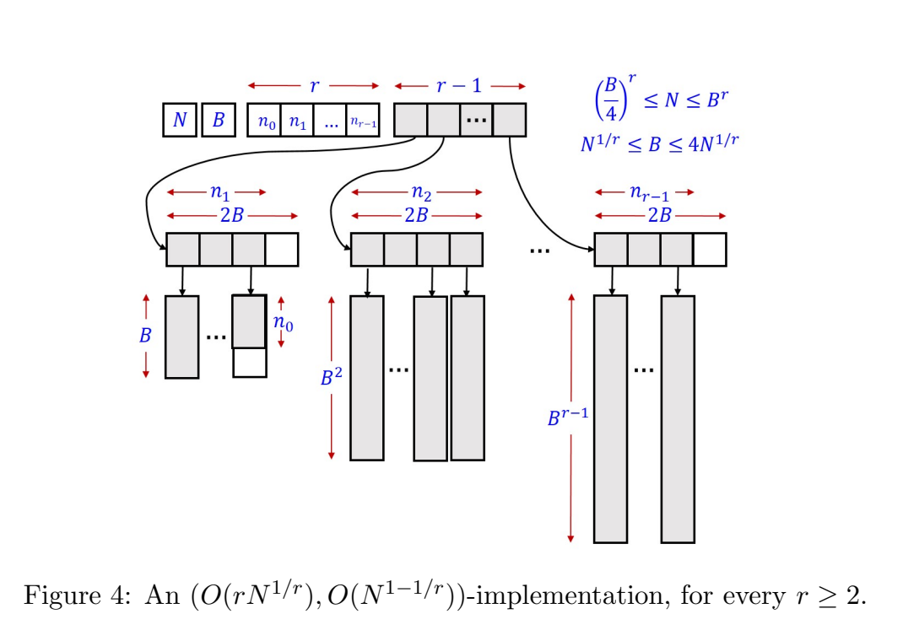
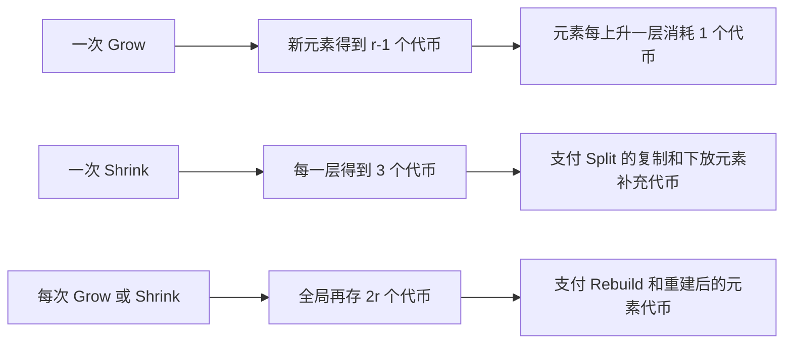

# 用冗余 $B$ 进制计数器实现可伸缩数组

普通数组要求元素存放在一段连续内存里，所以能够根据下标直接访问元素。但是连续数组的大小一旦确定，后面再想扩张就比较麻烦：原来那段内存后面可能已经被别的程序占用，只能申请一块更大的内存，再把旧元素全部复制过去。可伸缩数组（resizable array）研究的就是怎样在保持数组访问能力的同时，降低扩张和收缩造成的空间浪费与复制成本。

本文讨论的数组支持四种操作：

- `Grow(a)`：在数组末尾加入一个新元素 $a$；
- `Shrink()`：删除数组末尾的元素；
- `Access(i)`：读取下标为 $i$ 的元素；
- `Modify(i,a)`：把下标为 $i$ 的元素改成 $a$。

为了避免反复申请一整段连续内存，Tarjan 和 Zwick 把一个逻辑数组拆成多个大小不同的连续内存块。这里的“逻辑数组”是指：从使用者看来它仍然像普通数组一样有下标 $0,1,\ldots,N-1$，只是这些元素在物理内存中不一定连在一起。

开始之前，还需要区分三种容易混淆的指标：

- **最坏时间**：不管操作发生在什么状态，单次操作都不会超过这个时间。例如 Access 的最坏时间为 $O(1)$，意思是每一次访问都只需常数次基本操作。
- **摊还时间**：允许少数操作很贵，但把一长串操作的总成本平均以后，每次仍然很便宜。它不是概率意义上的“平均情况”。
- **常驻空间与临时空间**：常驻空间是操作结束后数据结构一直占用的空间；临时空间是复制元素时新旧块同时存在而短暂多出的空间。

作者引入一个整数参数 $r\ge2$。可以先把 $r$ 理解为数据块的层数：层数越多，块大小分得越细，常驻空间可以越接近只存放元素本身所需的 $N$ 个位置，但 Grow 和 Shrink 需要处理的层数也会增加。最终得到的权衡是：

- 存放 $N$ 个元素时，常驻空间为
  $$
  N+O(rN^{1/r});
  $$
- 调整过程中所需的峰值临时空间为
  $$
  O(N^{1-1/r});
  $$
- Access 和 Modify 的最坏时间为 $O(1)$；
- Grow 和 Shrink 的摊还时间为 $O(r)$。

这里的 $O(f(N))$ 表示忽略常数后不超过 $f(N)$ 这个数量级，$\Omega(f(N))$ 表示至少达到这个数量级，$\Theta(f(N))$ 则表示上下界都是同一个数量级。整套设计虽然公式不少，但主线只有一句话：**把不同大小的内存块看成 $B$ 进制计数器的不同数位，再用冗余数位给 Grow 和 Shrink 之间留出缓冲区。**

## 先从 $B$ 进制计数器理解整个结构

### “数位”怎样变成“内存块”

一个数据块（block）就是一次申请到的一段连续内存，例如一个大小为 $B^2$ 的块可以连续存放 $B^2$ 个元素。所有大小相同的块被看成同一层：第 $i$ 层保存大小为 $B^i$ 的块。层数越大，块也越大。

Okasaki 总结过一种很有用的看法：数据结构中不同尺寸组件的数量，可以看成一个数的各个数位。插入、删除、合并和拆分组件，分别对应数字的加一、减一、进位和借位[2]。放到本文中，对应关系如下：

| $B$ 进制计数器 | 本文的数据结构 |
| --- | --- |
| 数值 $N$ | 数组当前的元素数 |
| 第 $i$ 位的权重 $B^i$ | 一个大小为 $B^i$ 的数据块 |
| 第 $i$ 位的数字 $n_i$ | 大小为 $B^i$ 的块数 |
| 计数器加一 | Grow 一个元素 |
| 进位 | 把 $B$ 个 $B^i$ 块合成一个 $B^{i+1}$ 块 |
| 借位 | 把一个大块逐层拆成较小的块 |

本文选择参数 $B$，使得

$$
N^{1/r}\le B<4N^{1/r},
$$

可以先忽略常数 4，把它看成 $B\approx N^{1/r}$。这样做以后，最小的数据块大约有 $N^{1/r}$ 个位置，最高层的数据块大约有

$$
B^{r-1}\approx N^{1-1/r}
$$

个位置，正好对应后面临时空间的数量级。

数据块的大小依次为

$$
B,B^2,\ldots,B^{r-1}
$$

先只考虑 Grow，并暂时要求每层少于 $B$ 个块。新元素总是先放到 $B$ 块中；某层攒到 $B$ 个 $B^i$ 块时，就复制并合并成一个 $B^{i+1}$ 块。这就是一次进位：

$$
B\cdot B^i=B^{i+1}.
$$

一次 Grow 也可能连续触发几层进位。例如 $B=2$ 时，最低几层的状态会像普通二进制的

$$
0111+1=1000
$$

一样变化。区别是，普通计数器只改几个二进制位（bit），这里的每次进位却要真实地复制元素。

### 为什么加入 Shrink 后不能继续用普通计数器

普通进制在进位后会把当前位清零。如果刚进位就 Shrink，又可能马上借位：

```text
Grow:    许多小块 -> 一个大块
Shrink:  一个大块 -> 许多小块
Grow:    许多小块 -> 一个大块
```

也就是说，数组只增加或删除了一个元素，底层却反复搬动一大批元素。这种在临界点附近“来回折腾”的现象叫作 thrashing。它会破坏摊还分析，因为昂贵的合并和拆分之间没有足够多的普通操作来分担成本。

解决办法是使用**冗余表示**。冗余数字系统的标准含义不是“单纯浪费更多空间”，而是“同一个数可以有不止一种合法表示”[2]。例如取 $B=2$，8 个元素既可以写成 4 个大小为 2 的块，也可以写成 2 个大小为 2 的块加 1 个大小为 4 的块。两种分块方式表示的是同一个元素总数。

普通 $B$ 进制的数字范围是 $0,1,\ldots,B-1$，本文则允许每层最多出现 $2B$ 个块。达到 $2B$ 时，也不把这一层全部清空，而是只合并其中 $B$ 个：

$$
(n_i,n_{i+1})=(2B,n_{i+1})
\longrightarrow
(B,n_{i+1}+1).
$$

等式两边表示的元素数相同，因为

$$
2B\cdot B^i=B\cdot B^i+B^{i+1}.
$$

进位后第 $i$ 层还留下 $B$ 个小块。下一次即使马上 Shrink，也可以先从这些小块中删除，不必立即把刚生成的大块拆开。这个从 $B$ 到 $2B$ 的区间就是缓冲区，也可以理解为一种“滞后”设计：触发合并和触发拆分的状态不是同一个，中间故意留出一段安全距离。

这里必须区分两件事：本文没有直接采用 Okasaki 的 skew binary 数据结构；Okasaki 提供的是“数字表示和数据结构相互对应”的视角，以及冗余表示的概念。允许每层达到 $2B$、进位时只合并 $B$ 个块，是 Tarjan-Zwick 针对分块数组设计的具体规则。论文还指出，Kaplan 等人在另一个问题中也使用了相似的冗余 $B$ 进制计数器[4]。

## 数据结构具体怎样存放元素



图 1：使用多种块大小的可伸缩数组结构，裁自原论文[1]。

图中下方细长的长方形是实际保存元素的数据块，上方较短的横条是索引块（index block）。索引块本身不保存数组元素，只保存指向数据块的地址。这样，移动一个数据块在索引中的位置通常只需修改一个指针，不必移动块内的全部元素。

数据结构保存以下信息：

- $N$：当前元素总数；
- $B$：当前的进制参数；
- $n_i$：大小为 $B^i$ 的数据块个数，其中 $1\le i\le r-1$；
- $n_0$：最后一个 $B$ 块已经装入的元素数；
- $A$：顶层指针块，保存各层索引块的地址；
- $A[i]$：第 $i$ 层的索引块，长度为 $2B$，其中 $A[i][j]$ 指向该层第 $j$ 个数据块。

大小为 $B^2,\ldots,B^{r-1}$ 的块一定是满的。大小为 $B$ 的块中，只有最后一个允许没有装满。逻辑上，较大的块保存下标较小、也就是更早进入数组的元素；数组末尾的元素位于较小的块中。因此 Grow 和 Shrink 主要在最低层工作，只有最低层达到边界时才向上合并或从上面拆分。

原论文在解释增删操作和解释常数时间访问时，对 $n_1$ 使用了两种稍有不同的记法。解释增删操作时，$n_1$ 包括最后一个可能没有装满的 $B$ 块，$n_0$ 表示这个末块实际装了多少元素。解释访问算法时，$n_1$ 只统计已经装满的 $B$ 块，部分填充块完全由 $n_0$ 单独表示。后文讨论访问算法时采用第二种定义，否则总元素数的展开式会对不上。

## Grow、Shrink、合并和拆分怎样执行

下面的伪代码保留原论文的逻辑，但把变量更新写得更完整。`Allocate(s)` 表示向内存管理器申请一个能放 $s$ 个元素的新块，`Deallocate(X)` 表示释放块 $X$，`Copy(X,x,Y,y,s)` 表示把 $X$ 中从位置 $x$ 开始的 $s$ 个元素复制到 $Y$ 中从位置 $y$ 开始的地方。`Rebuild(B')` 表示把参数改为 $B'$，再按新的块大小重新组织所有元素。

### Grow：先处理边界，再写入新元素

```text
Grow(a):
    if N = B^r:
        Rebuild(2B)
    else if n1 = 2B and n0 = B:
        Combine-Blocks()
    else if n1 = 0 or n0 = B:
        A[1][n1] <- Allocate(B)
        n1 <- n1 + 1
        n0 <- 0

    A[1][n1 - 1][n0] <- a
    n0 <- n0 + 1
    N <- N + 1
```

它分成三种情况：

1. 如果 $N=B^r$，说明 $B$ 相对当前规模已经太小，令 $B\leftarrow2B$ 并整体重建；
2. 如果最低层已经有 $2B$ 个满块，先执行进位；
3. 如果还没有 $B$ 块，或者最后一个 $B$ 块已满，就新分配一个 $B$ 块。

最后，新元素一定可以写入某个未满的 $B$ 块。

### Combine-Blocks：把小块合并成大块

```text
Combine-Blocks():
    k <- min { i in [1, r-1] | ni < 2B }
    if k does not exist:
        error

    for i <- k-1 downto 1:
        A[i+1][n(i+1)] <- Allocate(B^(i+1))

        for j <- 0 to B-1:
            Copy(A[i][j], 0,
                 A[i+1][n(i+1)], j * B^i, B^i)
            Deallocate(A[i][j])
            A[i][j] <- A[i][j+B]     // 把剩余 B 个指针移到前面

        ni <- B
        n(i+1) <- n(i+1) + 1
```

调用这个过程时，第 1 层已经满到 $2B$。`min` 表示寻找编号最小、也就是最低的未满层 $k$。这样一来，第 $1,\ldots,k-1$ 层都已经有 $2B$ 个块，需要逐层进位。`downto` 表示下标递减，所以循环按 $k-1,k-2,\ldots,1$ 的顺序执行：先给较高层腾出并确定位置，再处理较低层送上来的新块。

在第 $i$ 层中，最前面的 $B$ 个块包含更早的元素，因此把它们按原顺序复制到新的 $B^{i+1}$ 块。剩下的 $B$ 个 $B^i$ 块不需要复制，只移动指针即可。完成后

$$
n_i:2B\to B,\qquad n_{i+1}:n_{i+1}\to n_{i+1}+1.
$$

如果索引块实现成循环数组，连移动这 $B$ 个指针都可以省掉。循环数组可以理解为把数组首尾接起来，用一个“起点下标”表示逻辑上的第一个位置。

### Shrink：最低层为空时才拆大块

```text
Shrink():
    if N = (B/4)^r:
        Rebuild(B/2)
    else if n1 = 0:
        Split-Blocks()

    n0 <- n0 - 1
    N <- N - 1

    if n0 = 0:
        Deallocate(A[1][n1 - 1])
        n0 <- B
        n1 <- n1 - 1
```

Shrink 只删除数组最后一个元素。只要还有 $B$ 块，它就不碰更大的块；只有 $n_1=0$ 时才执行 Split-Blocks。删除后如果最后一个 $B$ 块变空，就释放它，并把前一个满的 $B$ 块视为新的末块，所以令 $n_0\leftarrow B$。

### Split-Blocks：把一个大块逐层拆成小块

```text
Split-Blocks():
    k <- min { i in [1, r-1] | ni > 0 }
    if k does not exist:
        error

    for i <- k-1 downto 1:
        n(i+1) <- n(i+1) - 1

        for j <- 0 to B-1:
            A[i][j] <- Allocate(B^i)
            Copy(A[i+1][n(i+1)], j * B^i,
                 A[i][j], 0, B^i)

        Deallocate(A[i+1][n(i+1)])
        ni <- B
```

这里的 $k$ 是当前最小的非空层，所以在开始时 $1,\ldots,k-1$ 层都是空的。先把一个 $B^k$ 块拆成 $B$ 个 $B^{k-1}$ 块；下一轮再拿走最后一个 $B^{k-1}$ 块，把它拆成 $B$ 个 $B^{k-2}$ 块。一直做到底层后，最终得到：

- $B$ 个大小为 $B$ 的块；
- 对每个 $2\le i\le k-1$，有 $B-1$ 个大小为 $B^i$ 的块。

元素总数没有变化，因为

$$
B\cdot B+(B-1)\sum_{i=2}^{k-1}B^i=B^k.
$$

这不是只借出“够删一个元素”的空间，而是一次准备了 $B^k$ 个低层元素。后续很多次 Shrink 都可以直接消费这些小块，所以一次昂贵的 Split 能够被摊开。

有一个值得核对的细节：原论文的伪代码在每轮分配出 $B$ 个 $B^i$ 块后，没有显式写出 `ni <- B`。但是正文明确说新产生了 $B$ 个块，而且下一轮要先把这个数量减一；如果不更新 $n_i$，伪代码无法继续执行。因此上面的整理版补上了这一行。

## 为什么整体重建要设置两个不同的阈值

前面的合并与拆分只改变相邻层的数据块，参数 $B$ 本身没有变化。但是随着元素总数 $N$ 不断增大或减小，原来的 $B$ 会逐渐不适合当前规模。这时需要执行 Rebuild，也就是选一个新的 $B$，扫描现有元素，并按照新的块大小重新分组。一次 Rebuild 会复制全部 $N$ 个元素，因此不能频繁发生。

本文的重建规则是：

$$
N=B^r\quad\Longrightarrow\quad B\leftarrow2B,
$$

$$
N=(B/4)^r\quad\Longrightarrow\quad B\leftarrow B/2.
$$

如果扩张和收缩使用同一个边界，那么一次 Grow 触发扩大后，紧接着一次 Shrink 就可能触发缩小。这里的 $B^r$ 和 $(B/4)^r$ 故意离得很远，与每层允许 $B$ 到 $2B$ 个块是同一种思路：用不同的触发线制造滞后区间。

这个距离也正好够支付重建成本。一次令 $B$ 翻倍的 Rebuild 发生时，距离上一次重建至少经历

$$
B^r-(B/2)^r=N(1-2^{-r})\ge N/2
$$

次 Grow。一次令 $B$ 减半的 Rebuild 发生时，距离上一次同方向的规模至少相差

$$
(B/2)^r-(B/4)^r=(2^r-1)N\ge N
$$

次 Shrink。因此，两次 Rebuild 之间总有 $\Omega(N)$ 次普通操作，而一次 Rebuild 只复制 $N$ 个元素，平均到每次操作上就是常数级的重建成本。

## 空间账：每一项从哪里来

先看不处于复制过程中的常驻空间：

1. $N$ 个真正存储元素的位置：$N$；
2. 最后一个没有装满的 $B$ 块：浪费少于 $B$ 个位置，按 $B$ 计；
3. $r-1$ 个索引块，每个能放 $2B$ 个指针：$2(r-1)B$；
4. 顶层指针、$n_0,\ldots,n_{r-1}$、$N$、$B$ 等元数据：$O(r)$。

因此总量为

$$
N+B+2(r-1)B+O(r)=N+O(rB).
$$

论文按它的计数约定把中间式写成

$$
N+(2r-1)+2(r-1)B+B.
$$

又因为 $B=\Theta(N^{1/r})$，所以常驻空间是

$$
N+O(rN^{1/r}).
$$

再看操作瞬间的临时空间。最坏情况是准备生成最高层块时，新的 $B^{r-1}$ 块已经分配，而旧块还没有全部释放。因此峰值临时空间为

$$
B^{r-1}=\Theta(N^{1-1/r}).
$$

这里要区分“常驻的额外空间”和“复制瞬间的临时空间”。前者很小并不代表后者也同样小。

## 摊还分析：为什么平均每次只花 $O(r)$

### 先把记账法讲清楚

记账法又称 accounting method 或 banker’s method，是聚集分析的一种变形。英文资料通常把记账单位叫作 credit，下文统一称为“代币”。它只是分析时虚构出来的钱，不需要真的存进程序，也不占用数据结构的内存。

记账法的思路是：预先规定每次操作最多收取多少代币。便宜操作用不完，就把剩余代币存在账户里；以后某次操作需要复制很多元素时，再用以前存下来的代币付款。只要能够证明任何时刻账户余额都不会变成负数，就说明所有昂贵操作都已经被之前收取的代币覆盖。因此，每次固定收取的代币数就是摊还成本的上界[3]。

例如，假设连续 100 次操作中有 99 次成本为 1，只有 1 次成本为 100。虽然最贵的一次要花 100，但总成本只有 199，平均每次不到 2。摊还分析关心的是这种“整段操作的平均上界”，并不要求每一步本身都很便宜。

本文把一次 item assignment，也就是“把一个元素写到某个位置”，定义为 1 单位实际成本。第一次写入新元素和把旧元素复制到新块，都各算一次。这样定义已经够用，因为分配、释放、改计数器和改指针等基本操作的总数，与“元素写入次数 $+1$”成正比。这里的 $+1$ 不能省：有些普通 Shrink 完全不复制元素，但仍然要执行 $N--$ 和 $n_0--$。

按这个定义，如果一次 Combine 最终生成了 $B^k$ 块，它的真实成本是

$$
B(B+B^2+\cdots+B^{k-1})\le2B^k,\qquad B\ge2.
$$

一次第 $k$ 层 Split 则恰好复制 $B^k$ 个元素，所以真实成本是 $B^k$。下面的代币账要做的，就是让这两种偶尔出现的大成本都由之前的便宜操作支付。

为了不把不同用途的代币混在一起，可以想象有三类相互独立的账户：元素自己的账户支付向上合并，某一层的公共账户支付向下拆分，整个数据结构的总账户支付 Rebuild。



### Grow 的元素账户

位于第 $i$ 层的元素持有 $r-i$ 个代币。新元素总是先进入第 1 层，所以需要同时支付：

- 1 次真实写入；
- 给它存入 $r-1$ 个代币。

因此不计 Rebuild 时，一次 Grow 的摊还成本最多是

$$
1+(r-1)=r.
$$

Combine-Blocks 每复制一个元素，都会把它从第 $i$ 层移动到第 $i+1$ 层。该元素应持有的代币从 $r-i$ 降为 $r-i-1$，正好多出 1 个代币支付这次复制。换个角度看，一个新元素从第 1 层出发，今后最多上升 $r-1$ 层；现在预存的 $r-1$ 个代币，正好保证它每上升一层都能支付一次复制。因此 Combine 的摊还成本为 0。

### Shrink 的层账户：为什么恰好存 3 个代币

每次 Shrink 给每一层各存 3 个代币。因为一共至多有 $r$ 层，所以这一步先记下 $3r$ 的摊还成本。关键问题是：当第 $k$ 层真的发生 Split 时，这一层已经存了多少代币？

一次第 $k$ 层 Split 刚结束、尚未删除本次 Shrink 的末元素时，第 $1,\ldots,k-1$ 层一共恰好有 $B^k$ 个元素。一次 Combine 新建 $B^k$ 块后，这些低层也至少留下 $B^k$ 个元素。下一次要在第 $k$ 层 Split，必须先通过 Shrink 把这些低层元素全部删掉。因此，从上一次在第 $k$ 层发生 Combine 或 Split 到这一次 Split，至少经过了 $B^k$ 次 Shrink。第一次第 $k$ 层 Split 之前也同理。

于是 Split 发生时，第 $k$ 层至少已经积累

$$
3B^k
$$

个代币。这些钱需要支付两部分：

1. 把整个 $B^k$ 块复制到小块中，实际成本是 $B^k$；
2. 元素原来在第 $k$ 层，每个只持有 $r-k$ 个代币。下放到第 $i$ 层后应持有 $r-i$ 个，所以每个元素还要补 $k-i$ 个代币。

第二部分的总量可以按拆分后各层的元素数逐项相加：

$$
\begin{aligned}
&B(k-1)+(B-1)\sum_{i=1}^{k-1}(k-i)B^i\\
&\le B\sum_{i=1}^{k-1}(k-i)B^i\\
&\le B^{k+1}\sum_{j\ge1}jB^{-j}\\
&=\frac{B^{k+2}}{(B-1)^2}\\
&\le 2B^k,\qquad B\ge4.
\end{aligned}
$$

这串式子不需要死记。第一行是在逐层数“有多少元素被放到了第 $i$ 层，以及每个元素要补多少代币”。后面几行只是不断把它放大成更容易计算的上界：把有限求和扩展成无穷几何级数，再利用 $B\ge4$，得到补充代币的总量不会超过 $2B^k$。

所以一共最多需要

$$
B^k+2B^k=3B^k
$$

个代币。这就是“每层每次 Shrink 存 3 个”的来源：1 份支付真实复制，另外至多 2 份把下放元素的代币补足。于是 Split 的摊还成本也不大于 0。

例如 $B=4,k=2$ 时，一次 Split 处理的是大小为 $4^2=16$ 的块。下一次再拆同一层之前，必须先经过至少 16 次 Shrink，因此该层已经收到至少 $3\times16=48$ 个代币。其中 16 个支付实际复制，剩余至多 32 个给下放后的元素补代币，账目刚好覆盖。

### Rebuild 的全局账户

最后，每次 Grow 或 Shrink 再给整个数据结构存 $2r$ 个代币。由前面的双阈值分析可知，下一次 Rebuild 之前至少有 $N/2$ 次相关操作，因此至少能积累

$$
2r\cdot\frac N2=rN
$$

个代币。Rebuild 本身复制 $N$ 个元素；重建后，给全部元素重新配齐代币最多还需 $(r-1)N$。两项合计正好不超过 $rN$，所以 Rebuild 的摊还成本也可以记成 0。

把三本账加起来，每次操作领取的代币是 $O(r)$，因此 Grow 和 Shrink 的摊还成本都是 $O(r)$。论文还给出了更紧的重建账，但这里只需要渐近结论，没有必要把常数继续压小。

## 怎样把 Access 降到最坏 $O(1)$

元素被分散在不同大小的块中，所以 Access 的第一个问题是：给定下标 $i$，它究竟落在哪一层、哪一个块、块内哪个位置？最直接的做法是从大块到小块逐层减去元素数，需要检查 $r$ 层，因此耗时 $O(r)$；把每层的元素数做成前缀和并二分，可以降到 $O(\log r)$。

作者为了得到理论上的 $O(1)$，把所有层的块数编码进两个机器字。机器字（machine word）可以理解为 CPU 一次基本操作能够处理的整数，例如 64 位机器上的一个 64 位整数。word-RAM 模型假设，对一个机器字做加减、按位与、按位或和移位都只花常数时间。

这套访问方法可以先概括成三步：

1. 把所有层的块数紧凑地拼进两个机器字；
2. 用掩码一次算出若干层一共包含多少元素；
3. 用最高有效位大致判断目标层，再检查少数几种可能。

### 把冗余数字压进两个机器字

为了让每个数位都能对应固定数量的二进制位，作者要求 $B=2^b$。例如 $B=8$ 时 $b=3$，一个小于 $B$ 的数字正好可以放进 3 个二进制位。这里使用前面提到的第二种记法：$n_1$ 只统计装满的 $B$ 块，部分块中的元素数是 $n_0$。于是

$$
N=\sum_{j=0}^{r-1}n_jB^j,
\qquad 0\le n_j\le2B.
$$

这正是 $N$ 的冗余 $B$ 进制表示。把每个数字拆成

$$
n_j=n_j^0+B n_j^1,
\qquad 0\le n_j^0<B,\quad 0\le n_j^1\le2.
$$

所有 $n_j^0$ 按层依次拼成机器字 $N^0$，所有 $n_j^1$ 拼成机器字 $N^1$。这里的“拼接”不是做加法，而是把每个数字放进预先分好的 $b$ 个二进制位中。这样，每一层的块数都位于固定位置，可以用掩码和移位取出。

令

$$
N_k=\sum_{j=0}^{k-1}n_jB^j,
$$

它表示第 $0,1,\ldots,k-1$ 层一共存了多少元素，也就是大小小于 $B^k$ 的部分包含多少元素。掩码可以理解为一张二进制筛子：与掩码做按位与以后，掩码为 1 的位置被保留，为 0 的位置被清掉。预先准备低 $kb$ 位全为 1 的掩码

$$
M_k=2^{kb}-1,
$$

就能在常数时间得到

$$
N_k=(N^0\mathbin{\&}M_k)+((N^1\mathbin{\&}M_k)\ll b).
$$

### 用最高有效位把目标层缩到三种情况

由于小块位于数组末尾，从末尾倒着数更容易和低层前缀和比较。要访问下标为 $i$ 的元素，先计算它距离数组末尾有多少个位置：

$$
x=(N-1)-i.
$$

例如最后一个元素的 $x=0$，倒数第二个元素的 $x=1$。目标层 $k$ 是唯一满足

$$
N_k\le x<N_{k+1}
$$

的层。直观地说，$N_k\le x$ 表示目标已经越过了所有比第 $k$ 层更小的部分，而 $x<N_{k+1}$ 表示它还没有越过第 $k$ 层。

`msb(x)` 是 $x$ 的二进制表示中最高那个 1 的下标，`lsb(x)` 是最低那个 1 的下标，下标从 0 开始。例如 $40=(101000)_2$，所以 `msb(40)=5`，`lsb(40)=3`。

当 $x=0$ 时，`msb` 没有定义，需要单独处理：若 $n_0>0$，则 $k=0$；否则用后面相同的 `lsb` 技巧找到最小的非空层。对 $x>0$，先算

$$
\ell=\left\lfloor\frac{\operatorname{msb}(x)}b\right\rfloor,
$$

其中 $\operatorname{msb}(x)$ 是最高有效 1 的位置。因为 $x\ge B^\ell$，而 $B\ge4$ 时有

$$
N_{\ell-1}\le3B^{\ell-1}\le B^\ell\le x,
$$

所以目标层不会低于 $\ell-1$。接下来只有三种情况：

1. 如果 $x<N_\ell$，那么 $k=\ell-1$；
2. 如果 $N_\ell\le x<N_{\ell+1}$，那么 $k=\ell$；
3. 如果 $N_{\ell+1}\le x$，就在打包后的 $N^0\lor N^1$ 中，用 `lsb` 找到第一个大于 $\ell$ 且 $n_{\ell'}>0$ 的层，令 $k=\ell'$。

第三种情况可以直接写成

$$
\ell'=\left\lfloor
\frac{\operatorname{lsb}((N^0\lor N^1)\mathbin{\&}(\neg M_{\ell+1}))}{b}
\right\rfloor.
$$

`lsb` 也可以规约成 `msb`：

$$
\operatorname{lsb}(y)=\operatorname{msb}(y\mathbin{\&}(-y)).
$$

找到 $k$ 后，令

$$
q=i-(N-N_{k+1}).
$$

当 $k=0$ 时，目标就是部分填充的 $B$ 块中的第 $q$ 个元素。当 $k\ge1$ 时，目标在该层第

$$
\left\lfloor q/B^k\right\rfloor
$$

个块、块内第

$$
q\bmod B^k
$$

个位置。由于 $B^k=2^{bk}$，除法和取模都能分别用移位和按位与完成。Modify 只是在定位后改写该位置，因此同样是最坏 $O(1)$。

### 这个 $O(1)$ 更像理论结果

上述结论还依赖 `msb` 能在常数时间内算出的假设。论文提到：Fredman-Willard 的方法使用乘法；不使用乘法时，Brodal 的方法需要 $O(\log\log w)$，其中 $w$ 是一个机器字的位数；Brodnik、Miltersen 和 Munro 还给出了相匹配的下界[1]。作者自己也承认，实际程序中的 $r$ 通常很小，用 $O(\log r)$ 二分，甚至直接 $O(r)$ 扫描，可能反而更快。

我认为这是一个很好的批判点：论文证明了“模型允许时可以做到 $O(1)$”，但它不等于“工程上一定应该照这套位运算实现”。理论上的常数次复杂位运算，实际运行时未必比扫描几个层更快。

## 当层数取 $\Theta(\log N)$ 时会发生什么

令

$$
r=\Theta(\log N),
$$

则

$$
N^{1/r}=\Theta(1),
$$

所以 $B$ 是常数。按最直观的 $B=2$ 图像看，块大小就是 $2,4,8,\ldots$；正式分析中为了直接使用 $B\ge4$ 的不等式，也可以选择相邻的常数 $B=4$，这只改变常数，不改变结论。此时

$$
O(rN^{1/r})=O(\log N).
$$

因此可以得到：

$$
\boxed{
\text{常驻空间 }N+O(\log N),\quad
\text{Access 最坏 }O(1),\quad
\text{Grow/Shrink 摊还 }O(\log N)
}
$$

这几乎只比保存 $N$ 个元素本身多出对数个机器字，是整个构造最亮眼的结论。不过需要注意，$N+O(\log N)$ 说的是操作结束后的常驻空间；由一般公式可知，此时峰值临时空间 $O(N^{1-1/r})$ 仍是 $O(N)$ 量级，不能把两种空间混为一谈。

## 总结

这个数据结构并不是靠某个孤立技巧完成的，而是三层相同思路叠在一起：

1. 块大小 $B,B^2,\ldots$ 对应 $B$ 进制的各个数位；
2. 每层允许到 $2B$，合并后仍留下 $B$ 个块，避免 Grow 和 Shrink 立刻反向操作；
3. 整体重建使用 $B^r$ 与 $(B/4)^r$ 两条不同阈值，再次避免边界震荡。

最需要理解的是摊还分析中的三本账：元素账户支付向上合并，层账户支付向下拆分，全局账户支付整体重建。特别是“同一层两次拆分之间至少有 $B^k$ 次 Shrink”，把冗余表示留下缓冲区的直觉和正式的 $O(r)$ 摊还界连了起来。

## 参考文献

[1] TARJAN R E, ZWICK U. Optimal resizable arrays[EB/OL]. (2023-05-29)[2026-07-17]. <https://arxiv.org/abs/2211.11009>.

[2] OKASAKI C. Purely functional data structures[M]. Cambridge: Cambridge University Press, 1998: 61-72.

[3] 维基百科贡献者. 记账法[EB/OL]. 维基百科，自由的百科全书[2026-07-17]. <https://zh.wikipedia.org/wiki/记账法>.

[4] KAPLAN H, TARJAN R E, ZAMIR O, et al. Simulating a stack using queues[C]//Proceedings of the 33rd Annual ACM-SIAM Symposium on Discrete Algorithms. Philadelphia: Society for Industrial and Applied Mathematics, 2022: 1901-1924.
